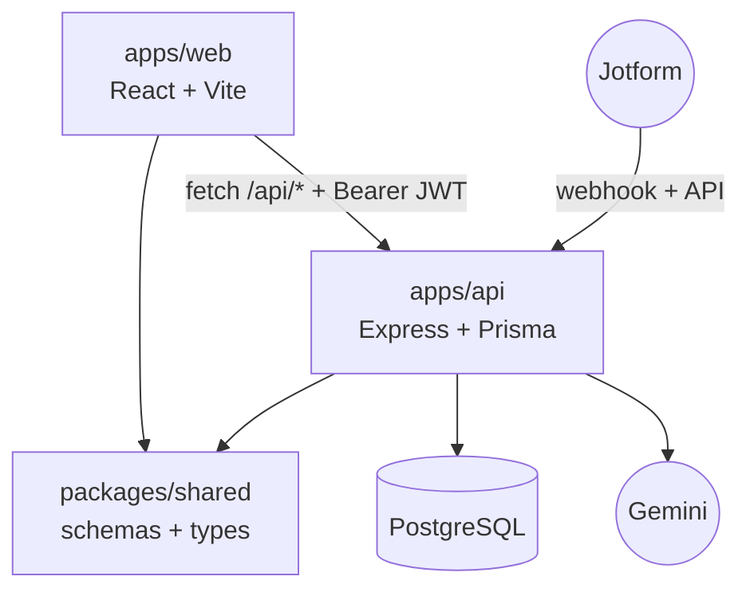
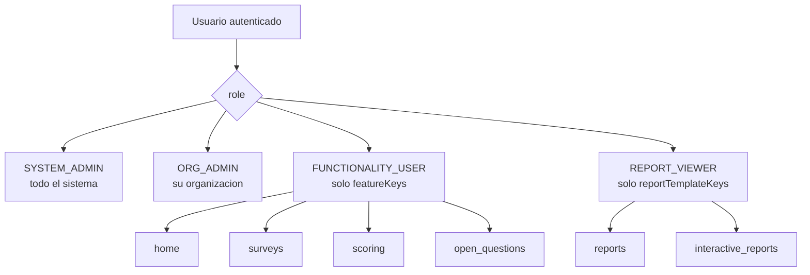
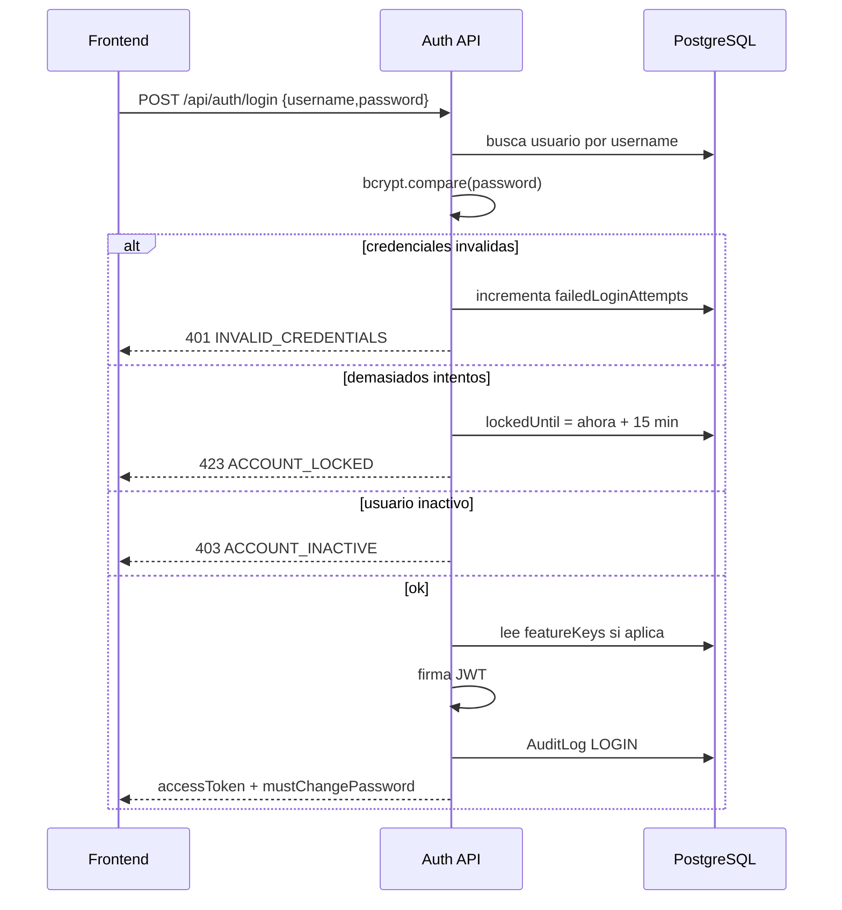
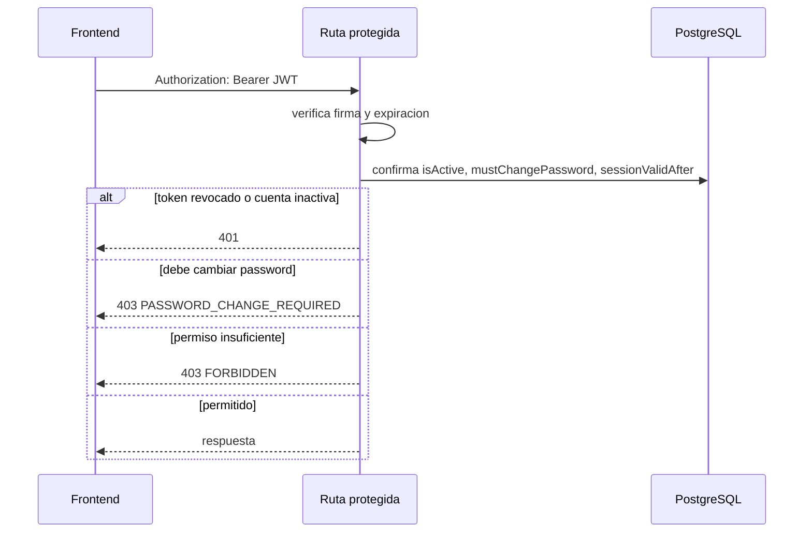
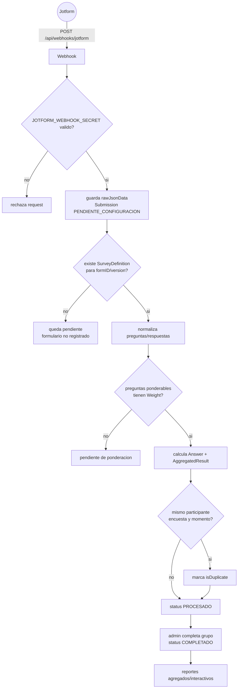
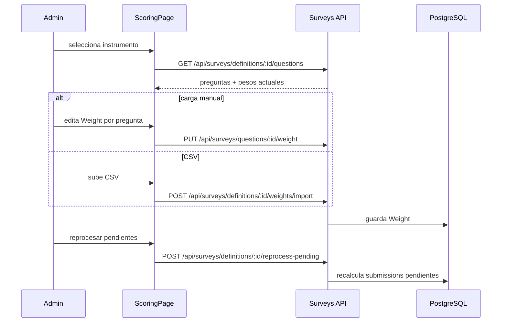
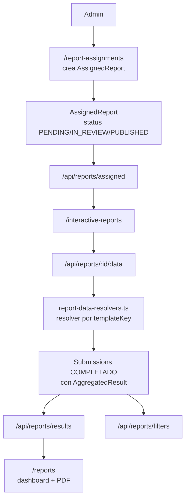
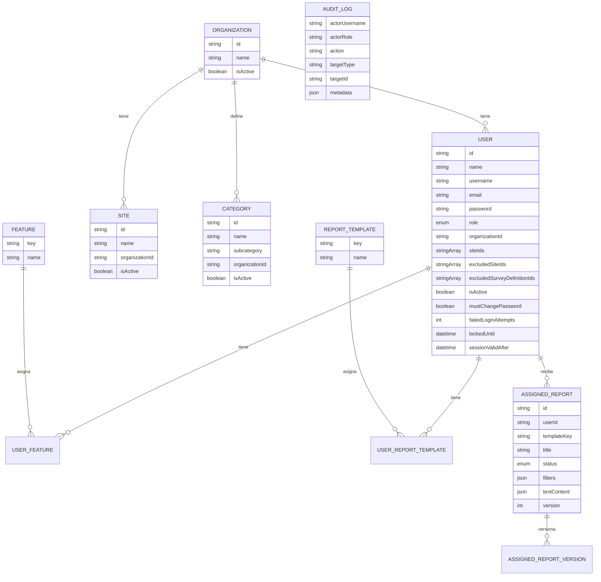
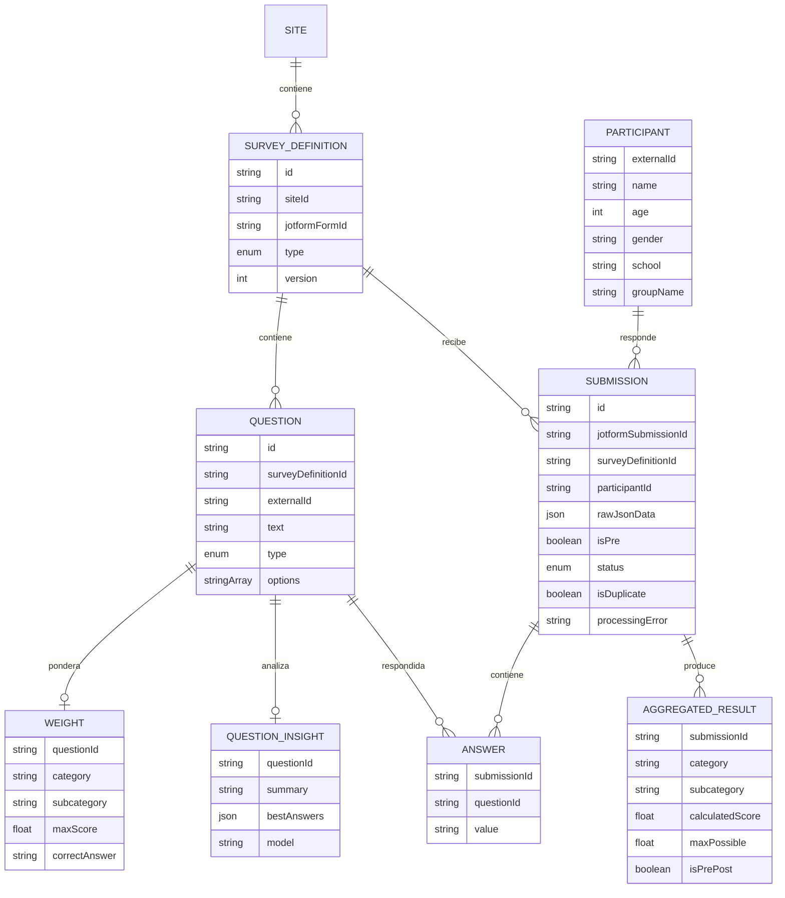

# EPI Web

Monorepo para administrar usuarios, organizaciones, sitios, evaluaciones Jotform, ponderaciones, resultados y reportes de EPI.

## Tecnologias

| Capa | Tecnologias |
| --- | --- |
| Monorepo | npm workspaces, TypeScript |
| Frontend | React 18, Vite, React Router, Zustand, MUI, Tailwind CSS |
| Offline/PWA | Dexie/IndexedDB, `vite-plugin-pwa`, cola local de mutaciones para usuarios |
| Backend | Node.js, Express, Helmet, CORS, Morgan, Zod |
| Base de datos | PostgreSQL, Prisma ORM, migraciones Prisma |
| Auth | JWT Bearer, bcrypt, roles, feature flags, revocacion de sesiones |
| Reportes | Recharts, `@react-pdf/renderer` |
| Integraciones | Jotform webhooks/API, Gemini para analisis de preguntas abiertas |

## Estructura

```text
apps/
  api/       Express + Prisma + modulos de negocio
  web/       React + Vite
packages/
  shared/    schemas Zod, tipos API y registro de features
docs/        documentacion detallada por flujo
```



## Features

| Feature | Ruta web | Backend | Permisos principales |
| --- | --- | --- | --- |
| Login | `/login` | `POST /api/auth/login` | publico |
| Home | `/home` | dashboard local/compartido | admin o feature `home` |
| Usuarios | `/users` | `/api/users` | `system_admin`, `org_admin` |
| Organizaciones | `/organizations` | `/api/organizations` | `system_admin` |
| Sitios | `/sites` | `/api/sites` | `system_admin`, `org_admin` |
| Categorias | `/categories` | `/api/categories` | `system_admin`, `org_admin` |
| Encuestas recibidas | `/surveys` | `/api/surveys` | admin o feature `surveys` |
| Ponderaciones | `/scoring` | `/api/surveys/definitions`, `/questions`, `/weights/import` | admin o feature `scoring` |
| Preguntas abiertas | `/open-questions` | `/api/surveys/questions/:id/analyze` | admin o feature `open_questions` |
| Reportes agregados | `/reports` | `/api/reports/results`, `/api/reports/filters` | admin o plantilla `reports` |
| Reportes interactivos | `/interactive-reports` | `/api/reports/assigned`, `/api/reports/:id/data` | admin o plantilla `interactive_reports` |
| Asignacion de reportes | `/report-assignments` | `/api/reports/assignments` | `system_admin`, `org_admin` |
| Auditoria | `/audit-log` | `/api/audit-logs` | `system_admin` |
| Settings | `/settings` | plantillas/catalogos | `system_admin` |

## Roles y permisos



## Flujo de autenticacion





## Flujo de encuestas Jotform



## Flujo de ponderaciones



## Flujo de reportes



## Base de datos

### Accesos y catalogos



### Encuestas y resultados



## Variables de entorno

| Variable | Uso |
| --- | --- |
| `DATABASE_URL` | conexion PostgreSQL |
| `PORT` | puerto API, default `3001` |
| `JWT_SECRET` | firma JWT, minimo 16 caracteres |
| `JWT_EXPIRES_IN` | expiracion JWT, default `7d` |
| `CORS_ORIGIN` | origen permitido para el frontend |
| `JOTFORM_WEBHOOK_SECRET` | secreto opcional para webhooks |
| `JOTFORM_API_KEY` | sincronizar formularios/preguntas Jotform |
| `JOTFORM_API_BASE` | default `https://api.jotform.com` |
| `GEMINI_API_KEY` | analisis IA de preguntas abiertas |
| `GEMINI_MODEL` | default `gemini-2.5-flash` |
| `CATALOG_DATA` | labels Jotform tratados como catalogo/filtro |

## Desarrollo

```bash
npm install
npm run db:migrate
npm run db:generate
npm run dev
```

Comandos utiles:

```bash
npm run dev:api
npm run dev:web
npm run build
npm run typecheck
npm run db:studio
npm run db:seed -w apps/api
```

El seed crea un usuario inicial:

```text
Username: admin
Password: Admin1234!
```

## Documentacion relacionada

- [`docs/arquitectura-front-backend.md`](docs/arquitectura-front-backend.md): arquitectura front/back detallada.
- [`docs/evaluaciones-flujo.md`](docs/evaluaciones-flujo.md): flujo completo de evaluaciones/Jotform.
- [`docs/administracion-accesos-flujo.md`](docs/administracion-accesos-flujo.md): usuarios, roles, organizaciones, sitios y seguridad.
- [`docs/modulo-gestion-de-evalaciones.md`](docs/modulo-gestion-de-evalaciones.md): modulo de gestion de evaluaciones.
