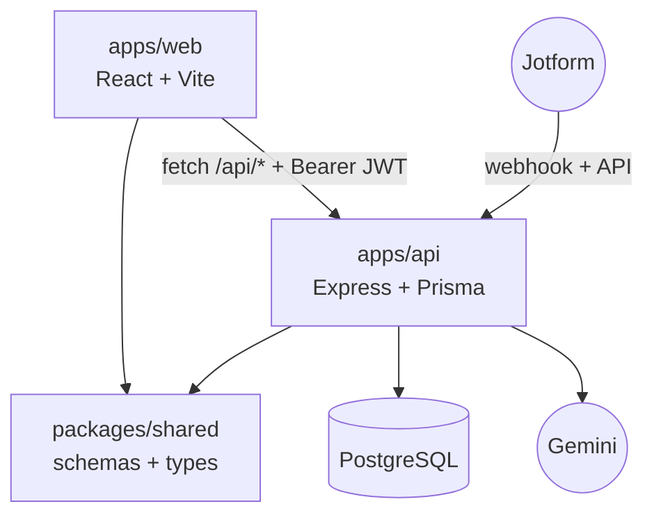
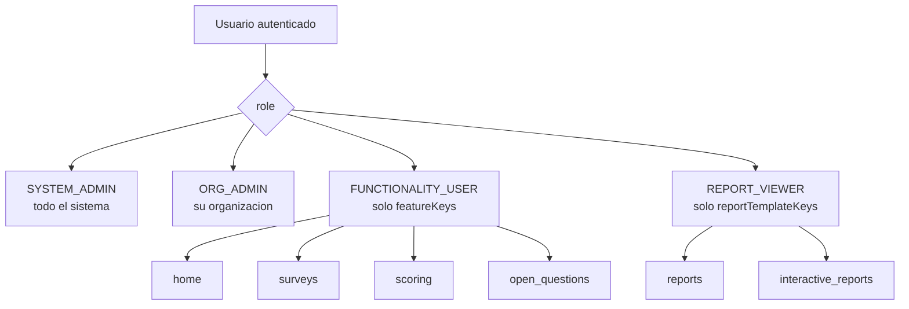
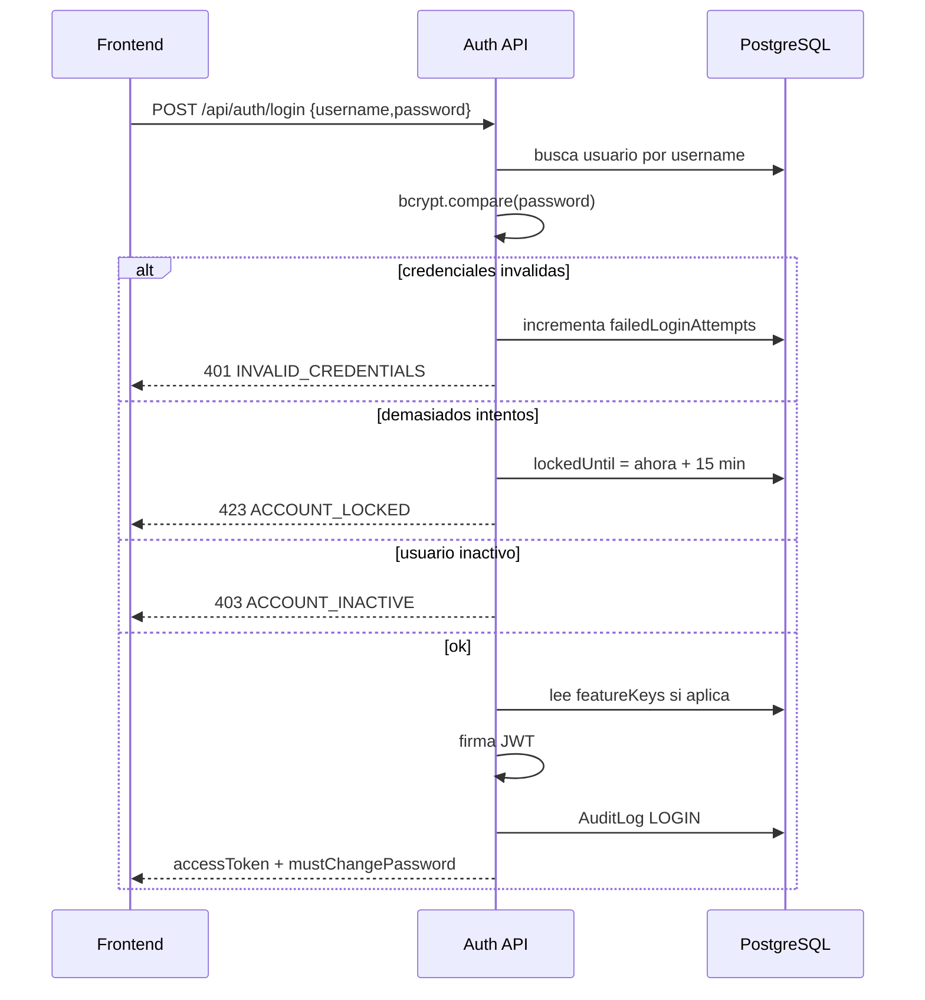
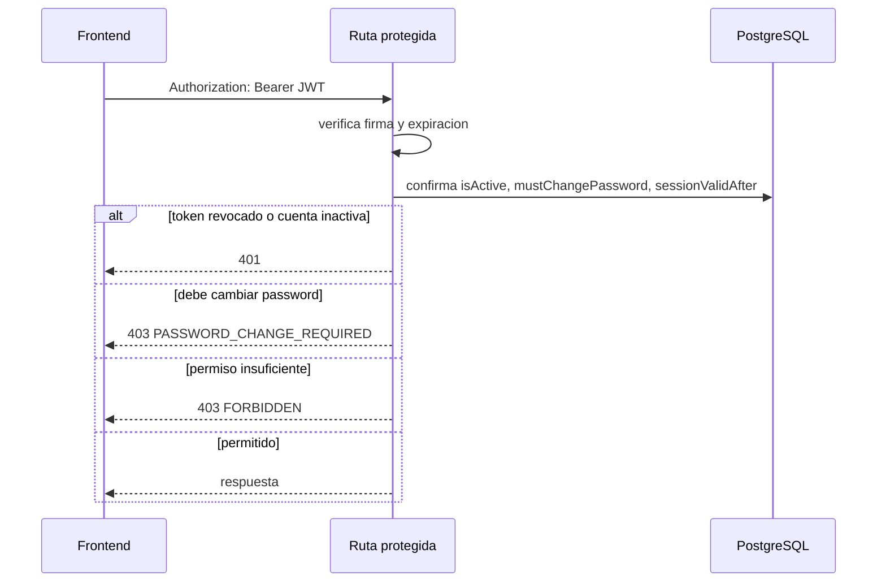
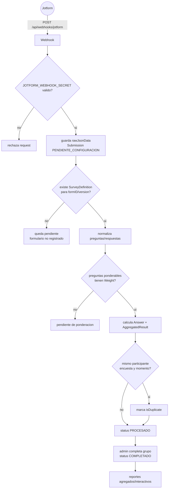
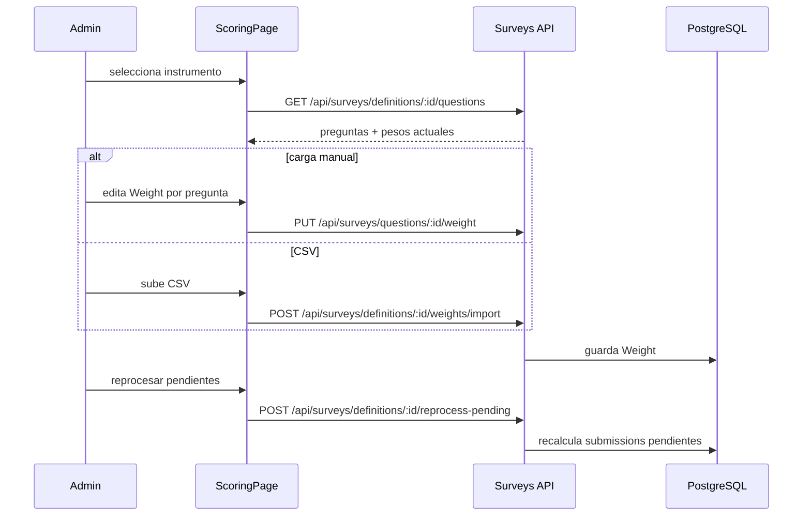
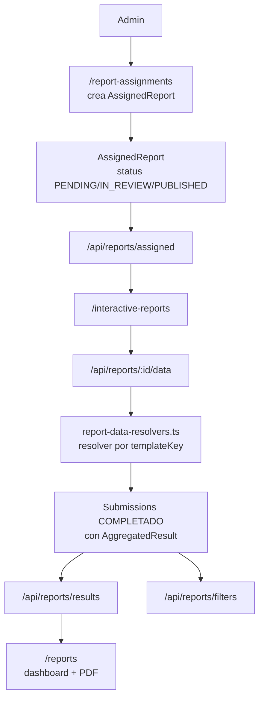
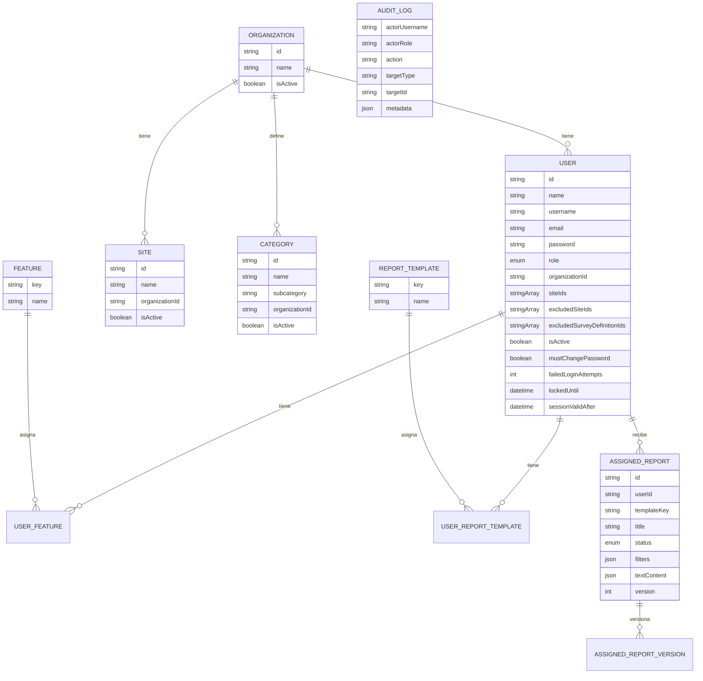
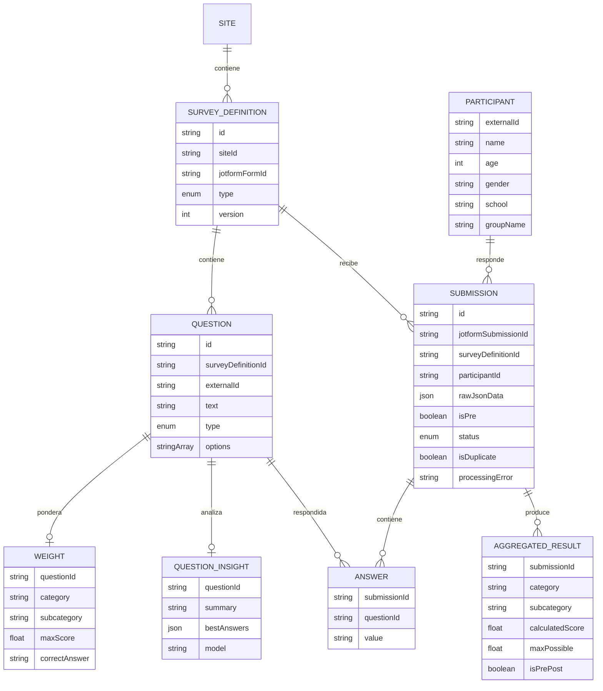

# EPI Web

Monorepo para administrar usuarios, organizaciones, sitios, evaluaciones Jotform, ponderaciones, resultados y reportes de EPI.

## Tecnologias

| Capa | Tecnologias |
| --- | --- |
| Monorepo | npm workspaces, TypeScript |
| Frontend | React 18, Vite, React Router, Zustand, MUI, Tailwind CSS |
| Offline/PWA | Dexie/IndexedDB, `vite-plugin-pwa`, cola local de mutaciones para usuarios |
| Backend | Node.js, Express, Helmet, CORS, Morgan, Zod |
| Base de datos | PostgreSQL, Prisma ORM, migraciones Prisma |
| Auth | JWT Bearer, bcrypt, roles, feature flags, revocacion de sesiones |
| Reportes | Recharts, `@react-pdf/renderer` |
| Integraciones | Jotform webhooks/API, Gemini para analisis de preguntas abiertas |

## Estructura

```text
apps/
  api/       Express + Prisma + modulos de negocio
  web/       React + Vite
packages/
  shared/    schemas Zod, tipos API y registro de features
docs/        documentacion detallada por flujo
```



## Features

| Feature | Ruta web | Backend | Permisos principales |
| --- | --- | --- | --- |
| Login | `/login` | `POST /api/auth/login` | publico |
| Home | `/home` | dashboard local/compartido | admin o feature `home` |
| Usuarios | `/users` | `/api/users` | `system_admin`, `org_admin` |
| Organizaciones | `/organizations` | `/api/organizations` | `system_admin` |
| Sitios | `/sites` | `/api/sites` | `system_admin`, `org_admin` |
| Categorias | `/categories` | `/api/categories` | `system_admin`, `org_admin` |
| Encuestas recibidas | `/surveys` | `/api/surveys` | admin o feature `surveys` |
| Ponderaciones | `/scoring` | `/api/surveys/definitions`, `/questions`, `/weights/import` | admin o feature `scoring` |
| Preguntas abiertas | `/open-questions` | `/api/surveys/questions/:id/analyze` | admin o feature `open_questions` |
| Reportes agregados | `/reports` | `/api/reports/results`, `/api/reports/filters` | admin o plantilla `reports` |
| Reportes interactivos | `/interactive-reports` | `/api/reports/assigned`, `/api/reports/:id/data` | admin o plantilla `interactive_reports` |
| Asignacion de reportes | `/report-assignments` | `/api/reports/assignments` | `system_admin`, `org_admin` |
| Auditoria | `/audit-log` | `/api/audit-logs` | `system_admin` |
| Settings | `/settings` | plantillas/catalogos | `system_admin` |

## Roles y permisos



## Flujo de autenticacion





## Flujo de encuestas Jotform



## Flujo de ponderaciones



## Flujo de reportes



## Manual descriptivo de interacciones

### 1. Entrar al sistema

Usuario:

1. Abre `/login`.
2. Escribe `username` y password.
3. Si el sistema pide cambio de password, entra al flujo obligatorio y define una nueva.
4. Al entrar, ve solo las pantallas permitidas por su rol, `featureKeys` o `reportTemplateKeys`.

Backend:

1. Busca el usuario por `username`.
2. Compara password con bcrypt.
3. Si falla, incrementa `failedLoginAttempts`; al quinto intento bloquea la cuenta 15 minutos.
4. Si el usuario esta activo, firma un JWT con `sub`, `username`, `role`, `organizationId` y `featureKeys`.
5. En cada request protegida vuelve a consultar la DB para validar `isActive`, `mustChangePassword` y `sessionValidAfter`.
6. Registra acciones sensibles en `AuditLog`.

### 2. Administrar usuarios, organizaciones, sitios y permisos

Usuario administrador:

1. Entra a `/organizations` para crear o activar/desactivar organizaciones.
2. Entra a `/sites` para crear sitios y asociarlos a una organizacion.
3. Entra a `/categories` para cargar categorias manualmente o por CSV.
4. Entra a `/users` para crear usuarios, asignar rol, organizacion, sitios de referencia, exclusiones, features o plantillas de reporte.
5. Si un usuario pierde acceso, puede desactivarlo, resetear password o forzar logout.

Backend:

1. `system_admin` puede operar todo el sistema.
2. `org_admin` queda limitado a su organizacion.
3. Las bajas logicas usan `isActive` donde aplica para no romper historicos.
4. `force-logout` y cambio de password actualizan `sessionValidAfter`, invalidando tokens emitidos antes.
5. Los permisos finos se guardan en `UserFeature` y `UserReportTemplate`.

### 3. Registrar formularios Jotform

Usuario administrador:

1. Entra a `/scoring`.
2. Sincroniza el catalogo de formularios Jotform.
3. Selecciona un formulario nuevo.
4. Lo asocia a un sitio y tipo de encuesta (`LOCAL` o `VISITING`).
5. Revisa las preguntas detectadas.

Backend con Jotform:

1. Usa `JOTFORM_API_KEY` para pedir formularios a `JOTFORM_API_BASE`.
2. Guarda/actualiza `JotformForm` con el `formID` real.
3. Descarga preguntas del formulario cuando el admin quiere previsualizar o registrar.
4. Crea `SurveyDefinition` por `jotformFormId` y `version`.
5. Crea `Question` para las preguntas ponderables.
6. Las preguntas configuradas en `CATALOG_DATA` se guardan como `CatalogField` y sirven como filtros, no como preguntas ponderadas.

### 4. Recibir respuestas desde Jotform

Usuario operativo:

1. No captura respuestas manualmente en el sistema.
2. Revisa `/surveys` para ver respuestas recibidas, pendientes, errores o duplicadas.
3. Si hay formularios no registrados o preguntas sin peso, pasa a `/scoring`.

Backend con Jotform:

1. Recibe `POST /api/webhooks/jotform`.
2. Si existe `JOTFORM_WEBHOOK_SECRET`, exige `?secret=` o header `x-jotform-secret`.
3. Normaliza el payload de Jotform y conserva `rawJsonData` completo.
4. Crea o actualiza `Participant`.
5. Crea `Submission` idempotente por `jotformSubmissionId`.
6. Detecta si la respuesta es pre o post.
7. Si falta definicion o ponderacion, deja `Submission.status = PENDIENTE_CONFIGURACION`.
8. Si todo esta configurado, crea `Answer`, calcula `AggregatedResult` y marca `PROCESADO`.
9. Si ya existe una respuesta equivalente para participante/encuesta/momento, marca `isDuplicate`.

### 5. Configurar ponderaciones y reprocesar

Usuario operativo/admin:

1. Entra a `/scoring`.
2. Selecciona una definicion de encuesta.
3. Asigna categoria, subcategoria, puntaje maximo y respuesta correcta cuando aplica.
4. Puede cargar ponderaciones por CSV para acelerar el alta.
5. Ejecuta reproceso de pendientes cuando termina la configuracion.

Backend:

1. Guarda cada ponderacion en `Weight`.
2. Valida datos con schemas compartidos desde `packages/shared`.
3. Reprocesa submissions pendientes de esa definicion.
4. Si ahora todas las preguntas ponderables tienen peso, recalcula resultados.
5. Mantiene el JSON crudo aunque el procesamiento falle.

### 6. Analizar preguntas abiertas

Usuario operativo/admin:

1. Entra a `/open-questions` o a la vista de preguntas.
2. Elige una pregunta abierta.
3. Ejecuta analisis de IA.
4. Revisa resumen y mejores respuestas.

Backend:

1. Junta respuestas `OPEN_TEXT` de la pregunta.
2. Llama Gemini usando `GEMINI_API_KEY` y `GEMINI_MODEL`.
3. Guarda el resultado en `QuestionInsight`.
4. Devuelve resumen, mejores respuestas y modelo usado.

### 7. Crear y consultar reportes

Usuario operativo/admin:

1. Entra a `/reports` para revisar resultados agregados con filtros.
2. Usa graficas/tablas para validar datos antes de crear un reporte oficial.
3. Entra a `/report-assignments`.
4. Crea un reporte asignado: usuario destino, plantilla, titulo, filtros y textos libres.
5. Cambia el estado del reporte hasta `PUBLISHED` cuando este listo.

Usuario receptor del reporte:

1. Entra a `/interactive-reports`.
2. Ve solo los reportes que tiene asignados.
3. Selecciona filtros permitidos, por ejemplo sitio/global.
4. Consulta la vista interactiva.
5. Descarga PDF cuando necesita compartir o archivar.

Backend:

1. Guarda el documento en `AssignedReport`.
2. Guarda historial inmutable en `AssignedReportVersion`.
3. Para `/api/reports/:id/data`, busca el resolver por `templateKey` en `report-data-resolvers.ts`.
4. El resolver calcula KPIs, series y tablas con datos reales de encuestas.
5. Los textos libres vienen de `AssignedReport.textContent`.
6. Plantillas sin resolver devuelven data vacia hasta que se implemente su backend.

## Como subir nuevos disenos de reportes

Los disenos finales se convierten en plantillas de codigo. No hay carga visual tipo CMS todavia.

1. Guarda la referencia del diseno en `docs/` si es especificacion, o en una carpeta nueva `docs/report-designs/` si son imagenes/PDF exportados.
2. Crea una plantilla en `apps/web/src/features/reports/templates/<nombre>.template.ts`.
3. Usa `apps/web/src/features/reports/templates/types.ts`: bloques `kpi-group`, `chart`, `table` y `text`.
4. Registra la plantilla en `apps/web/src/features/reports/templates/index.ts`.
5. Si la plantilla necesita datos reales, agrega un resolver con el mismo `templateKey` en `apps/api/src/modules/reports-assignment/report-data-resolvers.ts`.
6. Si el PDF necesita layout especial, ajusta `apps/web/src/features/reports/lib/document-pdf.tsx`.
7. Si la vista interactiva necesita render distinto, ajusta `apps/web/src/features/reports/components/ReportRenderer.tsx`.
8. Ejecuta `npm run typecheck` y prueba `/interactive-reports` con un usuario que tenga esa plantilla asignada.

Checklist minimo por diseno:

- Nombre visible del reporte.
- `templateKey` estable, sin espacios.
- Filtros requeridos.
- Bloques que debe mostrar la vista.
- Bloques que debe incluir el PDF.
- Campos de texto que llenara el usuario operativo.
- Fuente de datos de cada KPI/grafica/tabla.
- Ejemplo esperado con datos reales o mock.

## Base de datos

### Accesos y catalogos



### Encuestas y resultados



## Variables de entorno

| Variable | Uso |
| --- | --- |
| `DATABASE_URL` | conexion PostgreSQL |
| `PORT` | puerto API, default `3001` |
| `JWT_SECRET` | firma JWT, minimo 16 caracteres |
| `JWT_EXPIRES_IN` | expiracion JWT, default `7d` |
| `CORS_ORIGIN` | origen permitido para el frontend |
| `JOTFORM_WEBHOOK_SECRET` | secreto opcional para webhooks |
| `JOTFORM_API_KEY` | sincronizar formularios/preguntas Jotform |
| `JOTFORM_API_BASE` | default `https://api.jotform.com` |
| `GEMINI_API_KEY` | analisis IA de preguntas abiertas |
| `GEMINI_MODEL` | default `gemini-2.5-flash` |
| `CATALOG_DATA` | labels Jotform tratados como catalogo/filtro |

## Desarrollo

```bash
npm install
npm run db:migrate
npm run db:generate
npm run dev
```

Comandos utiles:

```bash
npm run dev:api
npm run dev:web
npm run build
npm run typecheck
npm run db:studio
npm run db:seed -w apps/api
```

El seed crea un usuario inicial:

```text
Username: admin
Password: Admin1234!
```

## TODO

- Crear tests unitarios para servicios criticos: auth, permisos, scoring, Jotform ingest y resolvers de reportes.
- Limpiar comentarios del proyecto: dejar solo los que expliquen reglas de negocio o decisiones no obvias.
- Terminar reportes dinamicos: mas plantillas institucionales, vistas interactivas y salida PDF para cada diseno aprobado.
- Subir disenos finales de reportes a `docs/report-designs/` y convertirlos en plantillas de `apps/web/src/features/reports/templates/`.

## Documentacion relacionada

- [`docs/arquitectura-front-backend.md`](docs/arquitectura-front-backend.md): arquitectura front/back detallada.
- [`docs/evaluaciones-flujo.md`](docs/evaluaciones-flujo.md): flujo completo de evaluaciones/Jotform.
- [`docs/administracion-accesos-flujo.md`](docs/administracion-accesos-flujo.md): usuarios, roles, organizaciones, sitios y seguridad.
- [`docs/modulo-gestion-de-evalaciones.md`](docs/modulo-gestion-de-evalaciones.md): modulo de gestion de evaluaciones.
