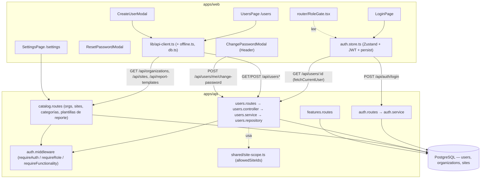
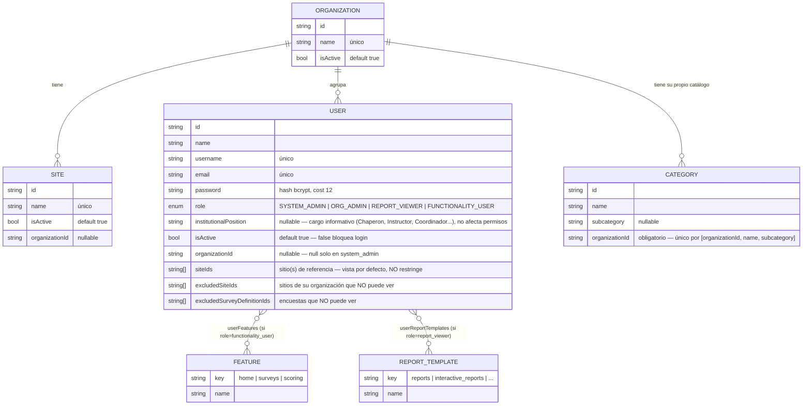
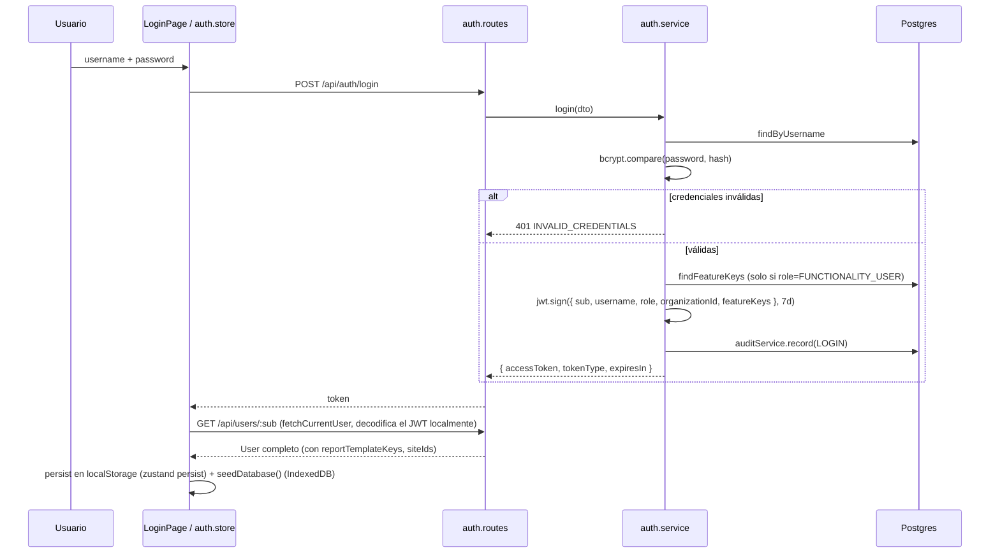
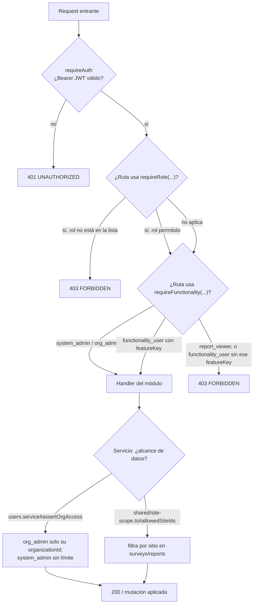
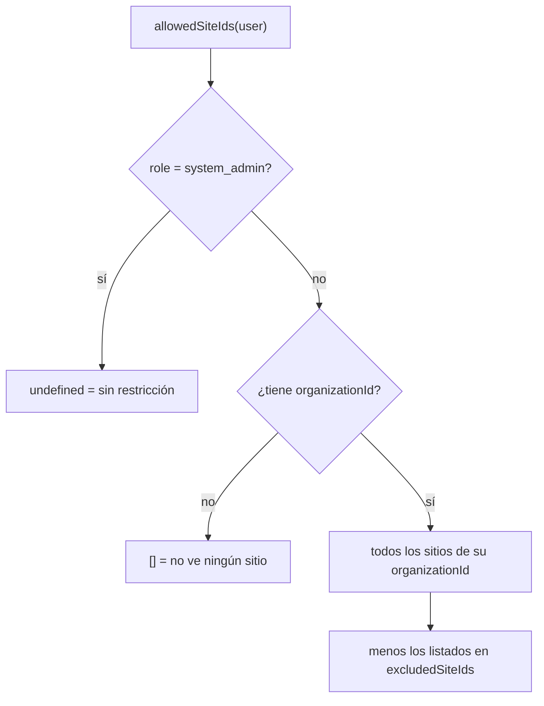
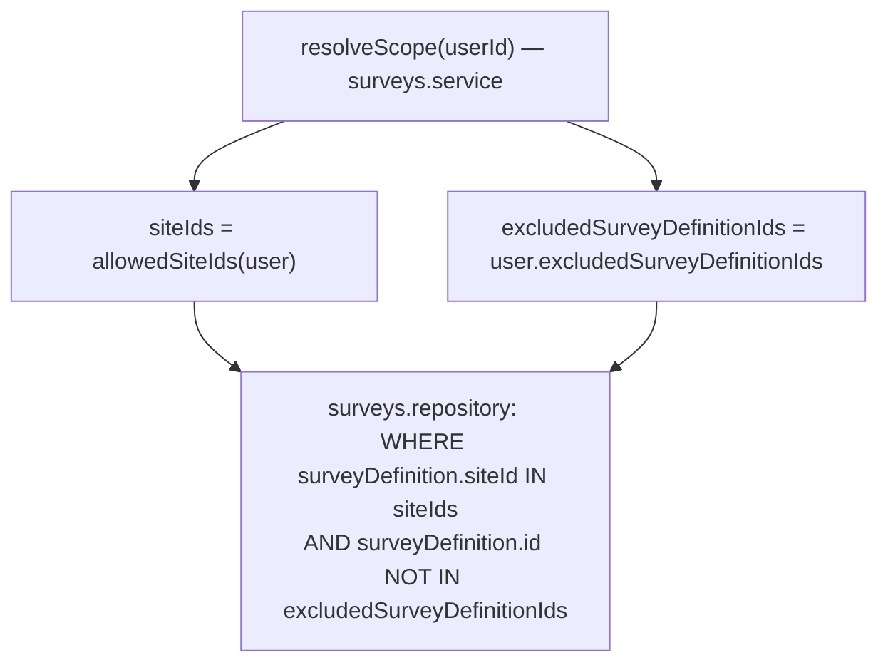
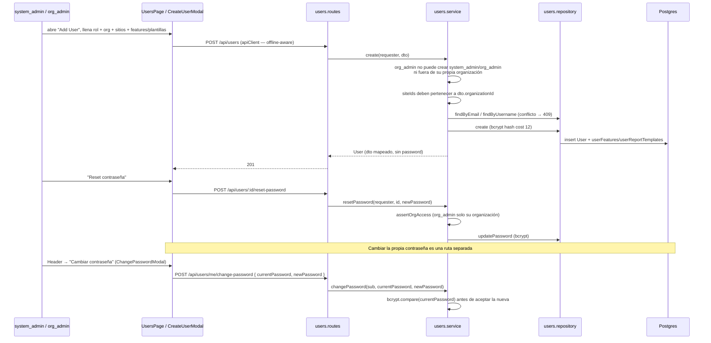
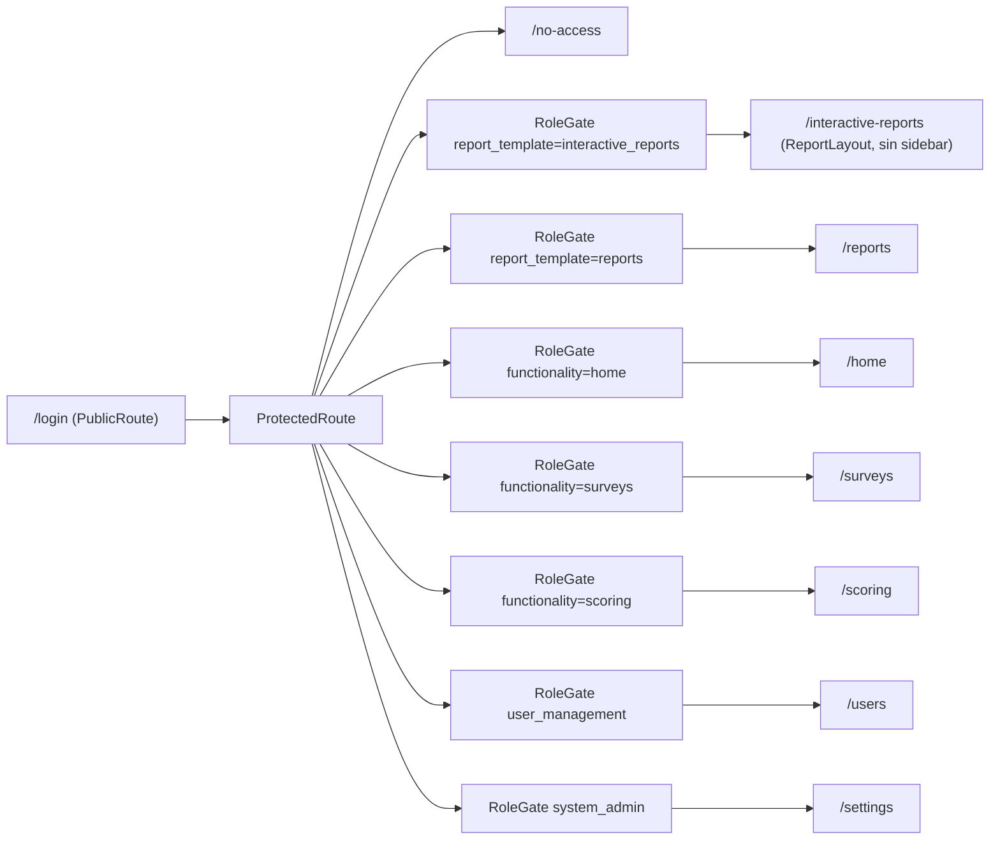

# Módulo de Administración, Usuarios y Seguridad — Funcionalidad y flujo

> Documento de arquitectura pensado para verse en Obsidian (los bloques
> ```mermaid``` se renderizan nativos). Cubre el estado **actual** del
> código (rama `dev`) contra la especificación funcional del módulo de
> Administración/Seguridad, señala qué se corrigió en esta iteración y qué
> sigue pendiente de definir con EPI. Complementa a
> [`arquitectura-front-backend.md`](./arquitectura-front-backend.md) (mapa
> general) y a [`evaluaciones-flujo.md`](./evaluaciones-flujo.md) (módulo de
> encuestas, que consume el alcance de organización/sitio definido aquí).

## 1. Panorama general



## 2. Modelo de datos



## 3. Roles del sistema (implementados)

| Rol de la especificación | `Role` en el código | Alcance implementado |
|---|---|---|
| Administrador del sistema | `system_admin` | Global. `organizationId = null`. Único que crea organizaciones y sitios. |
| Administrador de organización | `org_admin` | Su propia organización: usuarios, reset de contraseña, sitios (lectura), catálogo compartido. |
| Usuario Operativo | `functionality_user` | Solo los `featureKeys` (`home`/`surveys`/`scoring`) que el admin le asignó explícitamente. |
| Visualizador de reportes | `report_viewer` | Solo los `reportTemplateKeys` (`reports`/`interactive_reports`/...) asignados. |

`functionality_user` y `report_viewer` son mutuamente excluyentes: un
usuario tiene un solo `role`, y solo el arreglo correspondiente a ese rol
(`featureKeys` o `reportTemplateKeys`) se le respeta — el otro se ignora
(ver `users.repository.ts#create`, líneas de `featureData`/
`reportTemplateData`). Esto cubre "Permisos por funcionalidad" y "Permisos
sobre reportes" de la especificación, pero **como dos catálogos binarios
(tiene/no tiene acceso)**, no con acciones separadas (consultar/crear/
aprobar/exportar) — ver brecha en [§8](#8-brechas-frente-a-la-especificación).

## 4. Autenticación — login



El JWT lleva `sub`, `username`, `role`, `organizationId` y `featureKeys` —
no `reportTemplateKeys` ni `siteIds`. Por eso el frontend hace un segundo
`GET /api/users/:id` inmediatamente después del login para tener el
objeto `User` completo (`fetchCurrentUser` en `auth.store.ts`). El JWT
expira a los 7 días fijos; no hay refresh token ni revocación server-side
(logout es solo cliente).

## 5. Autorización — qué valida cada capa



`requireRole` protege por **ruta** (p. ej. crear/borrar usuarios, alta de
organizaciones/sitios: solo `system_admin`/`org_admin`, o solo
`system_admin` según el recurso). `requireFunctionality` protege los
módulos operativos (`surveys`, `scoring`) dejando pasar siempre a
`system_admin`/`org_admin`. La restricción **fina** (a qué organización o
usuario en particular se puede acceder) vive en el servicio, no en el
middleware — ver `users.service.ts#assertOrgAccess` y
`site-scope.ts#allowedSiteIds`.

## 6. Alcance de datos: organización, con exclusiones

El sitio **no es un allow-list**: por defecto todo usuario ve toda la
información de su organización (todos sus sitios y todas sus encuestas).
`siteIds` es solo el/los sitio(s) de referencia del usuario (para priorizar
esa vista por defecto en el frontend), no restringe nada. Lo que sí
restringe son dos listas de exclusión explícitas que administra
`system_admin`/`org_admin` al crear o editar un usuario:

- `excludedSiteIds` — sitios de su propia organización que ese usuario en
  particular no puede ver.
- `excludedSurveyDefinitionIds` — encuestas puntuales que ese usuario no
  puede ver, aunque su sitio sí esté permitido (una encuesta pertenece a un
  sitio, pero excluirla no depende de excluir el sitio completo).





Esto reemplaza el modelo anterior (allow-list por `org_admin`/
`functionality_user`/`report_viewer` basado en `user.siteIds`). Se usa en
el módulo de encuestas/reportes (`surveys.service#resolveScope`, que llama
`allowedSiteIds` de `shared/site-scope.ts` y combina el resultado con
`excludedSurveyDefinitionIds` en un único `SurveyScope` que viaja hasta
`surveys.repository.ts`). La exclusión por sitio ya cubre "un usuario no ve
un sitio de su organización"; la exclusión por encuesta cubre "un usuario ve
el sitio pero no una encuesta puntual de ese sitio" — ambas se validan en
`users.service.ts` (`create`/`update`) contra `usersRepository.sitesBelongToOrg`
/ `surveyDefinitionsBelongToOrg` para que un admin no pueda excluir (ni
tampoco fijar como referencia) un sitio o encuesta de otra organización.

## 7. Ciclo de vida de un usuario



**Corregido en esta iteración** (violaba el aislamiento entre
organizaciones que pide la especificación, sección "Aislamiento de
información entre organizaciones"):

1. `create()` ya bloqueaba a un `org_admin` de fijar un
   `organizationId` distinto al suyo; `update()` **no** tenía el mismo
   candado — un `org_admin` podía editar un usuario de su organización y
   reasignarle `organizationId` hacia otra organización. Ahora `update()`
   rechaza ese cambio igual que `create()`
   (`apps/api/src/modules/users/users.service.ts`).
2. `siteIds` nunca se validaba contra la organización dueña del sitio, ni
   en `create()` ni en `update()`. Como `allowedSiteIds` (§6) usa
   `user.siteIds` tal cual para `functionality_user`/`report_viewer`, un
   `siteId` de otra organización filtrado ahí habría dado acceso cruzado a
   datos de otra organización. Ahora ambos métodos validan
   (`usersRepository.sitesBelongToOrg`) que cada `siteId` pertenezca a la
   organización del usuario antes de guardar.
3. La cola de sincronización offline (`lib/db.ts` + `lib/offline.ts`,
   agregada como parte del PWA) está tipada y con los `RegExp` de rutas
   pensados específicamente para `/api/users`, pero `UsersPage.tsx` hacía
   sus propios `fetch()` en vez de pasar por `lib/api-client.ts` — la
   gestión de usuarios nunca funcionaba offline ni encolaba mutaciones a
   pesar de que la infraestructura ya existía. Se cambió `UsersPage.tsx` a
   usar `apiClient`, que es lo único que dispara `resolveOfflineGet` /
   `applyOptimisticWrite`.

Cada uno de estos tres puntos tiene un check ejecutable:
`apps/api/src/modules/users/users.service.selfcheck.ts` cubre los dos
primeros (`tsx src/modules/users/users.service.selfcheck.ts`); el tercero
se verificó con `tsc --noEmit` en `apps/web` tras el cambio.

**Agregado en esta iteración (2026-07-23)** — cambio de modelo: el sitio
deja de ser un allow-list y pasa a ser org-wide con exclusiones (ver §6
para el detalle del porqué):

1. Nuevos campos en `User`: `excludedSiteIds` y
   `excludedSurveyDefinitionIds` (arrays, mismo patrón que `siteIds`).
   `siteIds` cambia de significado — ya no restringe, es solo el sitio de
   referencia para la vista por defecto.
2. `shared/site-scope.ts#allowedSiteIds` ya no depende de `user.siteIds`
   para acotar: ahora siempre devuelve todos los sitios de la organización
   del usuario menos `excludedSiteIds` (system_admin sigue sin
   restricción). Esto cambia el comportamiento de `org_admin`,
   `functionality_user` y `report_viewer` por igual — antes
   `functionality_user`/`report_viewer` quedaban acotados a su propio
   `siteIds` si lo tenían asignado; ahora ven toda su organización salvo lo
   excluido.
3. `surveys.service.ts#resolveScope` ahora devuelve un `SurveyScope`
   (`{ siteIds, excludedSurveyDefinitionIds }` en vez de solo
   `siteIds`), que viaja hasta `surveys.repository.ts` para filtrar
   también por encuesta excluida en listados, resumen por grupo,
   reportes y catálogo de definiciones.
4. `users.service.ts` valida `excludedSiteIds` (con
   `usersRepository.sitesBelongToOrg`, igual que `siteIds`) y
   `excludedSurveyDefinitionIds` (con el nuevo
   `usersRepository.surveyDefinitionsBelongToOrg`) contra la organización
   del usuario, tanto en `create()` como en `update()` — un admin no puede
   excluir (ni fijar como sitio de referencia) algo que pertenece a otra
   organización.
5. `CreateUserModal.tsx` agrega dos listas de checkboxes ("Sitios
   excluidos" y "Encuestas excluidas") junto a la de sitio(s) de
   referencia, que ahora se etiqueta explícitamente como vista por
   defecto, no como restricción.

Checks ejecutables: `apps/api/src/shared/site-scope.selfcheck.ts`,
`apps/api/src/modules/surveys/surveys.repository.selfcheck.ts`, y los casos
nuevos agregados a `users.service.selfcheck.ts`.

## 8. Brechas frente a la especificación

Lo implementado es una base funcional real (roles, organizaciones, sitios,
scoping, permisos por feature/plantilla), pero **no** cubre todavía varios
puntos que la especificación describe explícitamente. Se documentan aquí
en vez de improvisar la respuesta de negocio:

- ~~**Categorías/subcategorías no son por organización.**~~ Corregido:
  `Category.organizationId` es obligatorio (migración
  `category_per_organization`; único por `[organizationId, name,
  subcategory]`, ya no por `[name, subcategory]` global).
  `GET /api/categories` filtra por organización igual que `/sites`
  (`system_admin` ve todas). `POST /api/categories/import` ahora reemplaza
  solo el catálogo de UNA organización (`?organizationId=` para
  `system_admin`; `org_admin` siempre importa a la suya, no puede tocar
  otra). CRUD individual de categorías se abrió a `org_admin` además de
  `system_admin` (antes era exclusivo de `system_admin`) — si no,
  ninguna organización aparte de la raíz podría mantener su propio
  catálogo. Ruta `/categories` en el frontend se movió del gate
  `system_admin` a `admin_tier` (`App.tsx`) para reflejarlo.
- ~~**Sin activar/desactivar.**~~ Corregido: `Organization`, `Site` y
  `User` tienen `isActive` (default `true`), editable vía `PATCH` en
  `catalog.routes.ts` y `users.routes.ts`, con toggle en
  `OrganizationsPage.tsx`/`SitesPage.tsx`/`UsersPage.tsx`. Un `User` con
  `isActive=false` no puede hacer login (`auth.service.ts` →
  `403 ACCOUNT_INACTIVE`). `DELETE /api/users/:id` sigue siendo borrado
  duro — desactivar es la alternativa no destructiva, pero no reemplaza el
  endpoint de borrado. ~~Nota: como no hay revocación de JWT...~~ ya no
  aplica: desde la iteración de "seguridad de sesión" (ver más abajo),
  `requireAuth` valida `isActive` en cada request, así que desactivar a
  alguien le corta el acceso de inmediato, no solo en su próximo login.
- ~~**Sin restricciones finas por encuesta o escuela.**~~ Corregido en esta
  iteración: `excludedSiteIds`/`excludedSurveyDefinitionIds` (§6) cubren
  exclusión por sitio y por encuesta puntual. Sigue sin existir exclusión
  por **escuela** (`Participant.school`, un dato libre que llega en el
  payload de Jotform, no un catálogo) — si la especificación necesita
  excluir por escuela específicamente, hace falta una lista separada
  (`excludedSchools`) o promover `school` a un catálogo propio.
- **Permisos por acción, no por verbo.** La especificación describe
  permisos granulares (consultar/crear/editar/aprobar/exportar/eliminar)
  independientes del rol. Hoy `featureKeys`/`reportTemplateKeys` son
  binarios: tener la clave da acceso de lectura+escritura a esa
  funcionalidad completa (lo que el propio endpoint permita), no hay
  matriz de acciones por usuario.
- ~~**Sin auditoría.**~~ Corregido: modelo `AuditLog` (sin FK a `User` a
  propósito — `actorUsername`/`actorRole`/`actorOrganizationId` son una
  foto del momento, el registro sobrevive aunque el actor se borre
  después). `modules/audit/audit.service.ts#record` escribe en
  `LOGIN` (`auth.service.ts`), `USER_CREATE`/`USER_DELETE`/
  `USER_ROLE_CHANGE`/`PASSWORD_RESET` (`users.service.ts`) y
  `CATEGORY_IMPORT` (`catalog.routes.ts`). El insert está envuelto en
  `try/catch` — si falla, se loguea a consola y la acción auditada sigue
  su curso normal (perder un registro de auditoría no debe tumbar la
  operación real). Lectura: `GET /api/audit-logs`, `system_admin`
  únicamente (cruza organizaciones), UI en `/audit-log`
  (`AuditLogPage.tsx`). El JWT ahora incluye `username` (antes no lo
  llevaba) para poder denormalizar el actor sin una query extra por
  acción. No se audita el cambio de la propia contraseña
  (`POST /users/me/change-password`) ni los intentos de login fallidos —
  fuera del alcance explícito de la especificación, se puede sumar
  después si hace falta para seguridad.
- ~~**Sin bloqueo de cuenta ni expiración de sesión configurable.**~~
  Corregido — con dos matices sobre el enunciado original:
  - La expiración (`JWT_EXPIRES_IN`) ya era configurable por variable de
    entorno antes de esta iteración; lo que faltaba de verdad era bloqueo
    por intentos fallidos y revocación.
  - **Bloqueo por intentos fallidos**: 5 seguidos → cuenta bloqueada 15
    minutos (`auth.service.ts#MAX_FAILED_ATTEMPTS`/`LOCKOUT_MINUTES`,
    constantes en código — mover a env si algún despliegue necesita otro
    valor). Un reset de contraseña (admin o propio) limpia el bloqueo.
  - **Revocación real, no solo "bloquear logins futuros"**:
    `requireAuth` ahora hace una consulta extra por request (antes era
    100% stateless) para confirmar `isActive` y comparar el `iat` del
    token contra `User.sessionValidAfter`. Eso significa que desactivar
    un usuario o forzar su cierre de sesión
    (`POST /api/users/:id/force-logout`, botón en `UsersPage.tsx`) corta
    el acceso al instante, con un token ya emitido y sin expirar — ya no
    es cierto lo que decía este documento antes ("un token vigente sigue
    funcionando hasta expirar"). Cambiar la contraseña (propia o por
    admin) también revoca sesiones existentes de ese usuario. El costo:
    cada request autenticado paga una consulta más a la base — aceptable
    para el tamaño de este sistema, pero es el trade-off a tener en
    cuenta si el volumen de tráfico cambia mucho.
  - El frontend (`api-client.ts`) cierra sesión localmente en cualquier
    respuesta `401 UNAUTHORIZED` (cuenta inactiva, sesión revocada, token
    expirado) — antes no había ningún manejo global de 401, un token
    inválido a mitad de sesión se quedaba en un estado raro sin redirigir
    a `/login`.
- ~~**Sin campo de "perfil o cargo institucional".**~~ Corregido: `User`
  tiene `institutionalPosition` (texto libre, opcional, sin efecto en
  permisos), editable en `CreateUserModal.tsx` y visible como columna en
  `UsersPage.tsx`. Solo hay UI de alta, no de edición — no existe todavía
  un modal de "editar usuario" en el frontend (el `PATCH /api/users/:id`
  del backend ya lo soporta).
- ~~**Multiorganización real sin probar con datos.**~~ Corregido:
  `seed.ts#seedDemoOrganizations` crea dos organizaciones ("Organización
  Demo A"/"B"), cada una con su sitio y su `org_admin`
  (`org_admin_a`/`org_admin_b`, contraseña igual al username) para probar
  el aislamiento manualmente. Idempotente, corre junto al resto del seed.
- ~~**Endpoints de reportes asignados no existen.**~~ Corregido:
  `modules/reports-assignment/` (`AssignedReport`/`AssignedReportVersion`
  en Prisma). `GET /api/reports/assigned` (mis reportes),
  `GET/POST/PATCH/DELETE /api/reports/assignments*` (panel de gestión,
  `system_admin`/`org_admin` acotado a su organización),
  `GET /api/reports/assignments/:id/versions` (historial — cada
  create/update genera una versión inmutable con actor y fecha) y
  `GET /api/reports/:id/data` (accesible por el asignado o un admin en su
  alcance). Persistencia + control de acceso por documento ya están
  resueltos; UI de gestión en `/report-assignments`
  (`ReportAssignmentsPage.tsx`).
  ~~**Con un límite deliberado:** `GET /:id/data` siempre devuelve vacío.~~
  Corregido parcialmente: `modules/reports-assignment/report-data-resolvers.ts`
  es un registro `templateKey → resolver` — `GET /:id/data` ahora calcula
  kpis/series/tables reales para las plantillas que tienen resolver
  registrado (hoy: `seasonal-site-report`, una plantilla de **prueba** que
  valida el pipeline completo con datos que sí existen). Las dos plantillas
  de ejemplo originales (`operational-financial`, `activities-attendance`,
  marcadas en el propio código como "Ejemplo 1"/"Ejemplo 2") siguen sin
  resolver — piden datos (ingresos/gastos, asistencia) que no existen en el
  modelo, y una plantilla sin resolver sigue devolviendo
  `{ kpis: {}, series: {}, tables: {} }` como antes (el `ReportRenderer` ya
  maneja bien ese caso). El alcance de sitios de cada resolver es el del
  **usuario asignado al reporte**, no el de quien lo consulta. Además:
  `AssignedReport.textContent` (Json, versionado igual que `filters`)
  guarda los campos de texto libre (logros, retos...) que cada plantilla
  declara y que el operativo llena desde `ReportAssignmentsPage.tsx`; el
  donante puede mover un filtro Sitio/Global acotado a su propio alcance; y
  la descarga es un PDF real (`@react-pdf/renderer`, ya no `window.print()`).
  Detalle completo, con diagrama de secuencia, en
  [arquitectura-front-backend.md §7](./arquitectura-front-backend.md#7-reportes-dos-sistemas-distintos-conviviendo).
  Sigue pendiente de negocio: los N diseños institucionales reales, que EPI
  está definiendo — la plomería ya está lista para recibirlos.

## 9. Endpoints (resumen)

| Método | Ruta | Quién | Qué hace |
|---|---|---|---|
| `POST` | `/api/auth/login` | Público | Emite JWT (7d) |
| `GET` | `/api/users` | `system_admin`/`org_admin` | Lista paginada; `org_admin` acotado a su organización |
| `GET` | `/api/users/:id` | Autenticado | A sí mismo siempre; a otros solo con `assertOrgAccess` |
| `POST` | `/api/users` | `system_admin`/`org_admin` | Crea usuario (valida org, siteIds y excludedSiteIds/excludedSurveyDefinitionIds) |
| `PATCH` | `/api/users/:id` | Autenticado (reglas en servicio) | Auto-edición limitada; admin edita dentro de su alcance |
| `DELETE` | `/api/users/:id` | `system_admin`/`org_admin` | Baja definitiva (no hay soft-delete) |
| `POST` | `/api/users/:id/reset-password` | `system_admin`/`org_admin` | Restablece contraseña de otro usuario (también limpia bloqueo por intentos fallidos y revoca sus sesiones) |
| `POST` | `/api/users/:id/force-logout` | `system_admin`/`org_admin` | Revoca de inmediato cualquier token vigente de ese usuario |
| `POST` | `/api/users/me/change-password` | Autenticado | Cambia la propia, valida `currentPassword` |
| `GET` | `/api/features` | Autenticado | Catálogo de `featureKeys` disponibles |
| `GET` | `/api/organizations` | Autenticado | Listado |
| `POST` | `/api/organizations` | `system_admin` | Alta |
| `GET` | `/api/sites` | Autenticado | `system_admin` ve todos; el resto solo su organización |
| `POST` | `/api/sites` | `system_admin` | Alta |
| `GET` | `/api/categories` | Autenticado | Catálogo de la propia organización (`system_admin` ve todas) |
| `POST`/`PATCH`/`DELETE` | `/api/categories(/:id)` | `system_admin`/`org_admin` | Alta/edición/baja individual, acotado a la organización |
| `POST` | `/api/categories/import?organizationId=` | `system_admin`/`org_admin` | CSV reemplaza solo el catálogo de esa organización (`org_admin` siempre la suya) |
| `GET` / `POST` / `PATCH` / `DELETE` | `/api/report-templates` | Autenticado / `system_admin` | Catálogo de plantillas asignables a `report_viewer` |
| `GET` | `/api/audit-logs` | `system_admin` | Bitácora paginada de acciones sensibles |

## 10. Frontend — mapa de rutas y gates



`RoleGate` (`apps/web/src/router/RoleGate.tsx`) espera a
`initCurrentUser()` (que llama a `GET /api/users/:id`); si el token existe
pero no logra resolver el usuario, hace `logout()`. `getDefaultRoute(user)`
decide a dónde mandar a cada rol tras el login según sus
`featureKeys`/`reportTemplateKeys`, cayendo en `/no-access` si no tiene
nada asignado — así se ve en el frontend la regla de la especificación de
que "el acceso a estas funcionalidades no será automático, deberá ser
otorgado expresamente".
