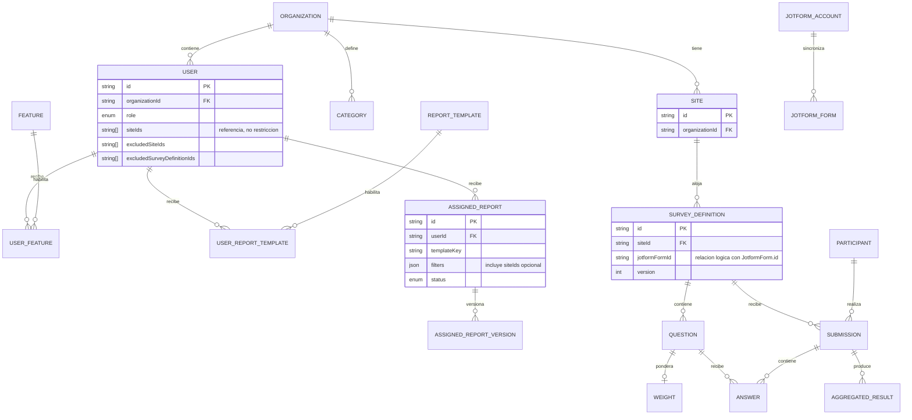

Analisis del Proyecto EPI Web

Fecha: 21 de septiembre de 2026

1. Objetivo

Desarrollar una plataforma web para administrar usuarios, organizaciones, sitios, instrumentos de evaluacion, respuestas recibidas desde Jotform, ponderaciones, resultados agregados y reportes institucionales de EPI.

El sistema busca centralizar el proceso operativo de evaluaciones: recibir respuestas, validar configuracion, calcular resultados, consultar indicadores y publicar reportes para usuarios autorizados.

2. Alcance

El proyecto contempla:

Autenticacion de usuarios mediante usuario, contrasena y token JWT.
Administracion de usuarios, roles, permisos, organizaciones, sitios y categorias.
Integracion con Jotform para sincronizar formularios, recibir respuestas por webhook e importar historicos.
Configuracion de instrumentos de evaluacion y ponderaciones.
Procesamiento de respuestas pre/post y calculo de resultados por categoria y subcategoria.
Consulta y edicion manual del resumen general de preguntas abiertas.
Consulta de resultados en dashboards y generacion de reportes.
Asignacion y publicacion de reportes interactivos.
Bitacora de auditoria para acciones sensibles.

Fuera de alcance inicial:

Captura manual de respuestas de evaluacion dentro del sistema.
Sincronizacion directa con Google Sheets.
Motor configurable de formulas estadisticas avanzadas.
Notificaciones externas por correo, Slack u otro canal.
CMS visual para disenar plantillas de reportes.

3. Actores

Administrador del sistema : Usuario con acceso global a organizaciones, usuarios, catalogos, auditoria, sitios, evaluaciones y reportes.
Administrador de organizacion : Usuario que administra informacion limitada a su organizacion.  
Usuario operativo : Usuario con acceso a funcionalidades especificas como encuestas, ponderaciones o preguntas abiertas.  
Visualizador de reportes : Usuario que consulta reportes asignados e interactivos.  
Jotform : Servicio externo que envia respuestas y provee catalogo de formularios.

4. Roles y permisos

system_admin`       : Acceso global al sistema. Puede gestionar organizaciones, usuarios, sitios, categorias, reportes, cuentas Jotform y auditoria.                      
org_admin` : Acceso administrativo limitado a su organizacion. Puede gestionar usuarios, sitios, categorias y reportes asignados dentro de su alcance. No ve el catalogo global ni las cuentas Jotform.
functionality_user`: Accede solo a funcionalidades asignadas mediante`featureKeys`.                                                                                     
report_viewer` : Accede solo a plantillas/reportes asignados mediante `reportTemplateKeys`.

Los permisos se aplican por ruta en frontend y backend. Adicionalmente, el backend filtra datos por organizacion, sitios permitidos y exclusiones de usuario.

5. Requerimientos funcionales

RF-01 Autenticacion y seguridad de sesion

El sistema debe permitir iniciar sesion con usuario y contrasena.
El sistema debe validar credenciales contra usuarios registrados.
El sistema debe bloquear temporalmente una cuenta despues de varios intentos fallidos.
El sistema debe impedir el acceso de usuarios inactivos.
El sistema debe solicitar cambio de contrasena cuando el usuario tenga esa marca activa.
El sistema debe permitir cerrar sesion.
El sistema debe permitir forzar el cierre de sesion de un usuario desde administracion.

RF-02 Administracion de usuarios

El sistema debe listar usuarios segun el alcance del administrador.
El sistema debe crear usuarios con nombre, username, correo, rol, organizacion y cargo institucional.
El sistema debe asignar permisos por funcionalidad a usuarios operativos.
El sistema debe asignar plantillas de reporte a visualizadores.
El sistema debe configurar sitios de referencia y exclusiones por sitio o instrumento.
El sistema debe activar o desactivar usuarios.
El sistema debe restablecer contrasenas.

RF-03 Administracion de organizaciones y sitios

El sistema debe permitir crear, editar, activar, desactivar y eliminar organizaciones.
El sistema debe permitir crear, editar, activar, desactivar y eliminar sitios.
El sistema debe asociar sitios a organizaciones.
El sistema debe limitar a administradores de organizacion a su propio alcance.

RF-04 Administracion de categorias

El sistema debe listar categorias y subcategorias por organizacion.
El sistema debe crear categorias manualmente.
El sistema debe crear multiples subcategorias en una sola operacion.
El sistema debe importar categorias mediante archivo CSV.
El sistema debe descargar una plantilla CSV de categorias.
El sistema debe activar, desactivar, editar y eliminar categorias.

RF-05 Integracion con Jotform

El sistema debe registrar cuentas Jotform mediante API key.
El sistema debe sincronizar formularios disponibles desde Jotform.
El sistema debe listar formularios sincronizados y su estado de registro.
El sistema debe previsualizar preguntas de un formulario.
El sistema debe registrar un formulario como instrumento de evaluacion asociado a sitio y tipo.
El sistema debe recibir respuestas mediante webhook.
El sistema debe validar un secreto de webhook cuando este configurado.
El sistema debe conservar el JSON crudo de cada respuesta recibida.
El sistema debe importar respuestas historicas desde Jotform por instrumento y rango de fechas.

RF-06 Gestion de encuestas recibidas

El sistema debe listar respuestas recibidas.
El sistema debe filtrar respuestas por instrumento, sitio, tipo, estado, grupo, pre/post y fecha.
El sistema debe identificar respuestas pendientes de configuracion.
El sistema debe identificar respuestas con error de procesamiento.
El sistema debe identificar posibles duplicados.
El sistema debe permitir reprocesar respuestas pendientes o con error.
El sistema debe mostrar resumen por grupo con conteos pre/post, alumnos y respuestas en blanco.
El sistema debe permitir marcar como completado un grupo cuando tenga informacion pre y post suficiente.

RF-07 Configuracion de ponderaciones

El sistema debe listar instrumentos de evaluacion configurados.
El sistema debe listar preguntas ponderables de un instrumento.
El sistema debe permitir editar el tipo de pregunta.
El sistema debe asignar categoria, subcategoria, puntaje maximo y respuesta correcta cuando aplique.
El sistema debe eliminar ponderaciones.
El sistema debe guardar ponderaciones individualmente o en bloque.
El sistema debe descargar una plantilla CSV de ponderaciones.
El sistema debe importar ponderaciones mediante CSV.
El sistema debe reprocesar respuestas pendientes despues de completar la configuracion.

RF-08 Preguntas abiertas

El sistema debe listar preguntas abiertas por instrumento.
El sistema debe mostrar las respuestas recibidas debajo de cada pregunta para su analisis manual.
El sistema debe guardar un resumen general de preguntas abiertas por instrumento.
El sistema debe mostrar preguntas abiertas para su analisis manual.
El sistema debe mostrar las preguntas abiertas y permitir editar el resumen general del instrumento.

RF-09 Reportes agregados

El sistema debe consultar resultados agregados de respuestas completadas.
El sistema debe filtrar reportes por encuesta, sitio, tipo, escuela, categoria y rango de fechas.
El sistema debe mostrar el resultado total Pre vs Post y el cambio en puntos porcentuales.
El sistema debe mostrar el porcentaje individual por pregunta y el cambio por pregunta.
El sistema debe mostrar el resultado Pre/Post por categoria y subcategoria.
El sistema debe mostrar graficas de barras, radar, cambios pre/post y tablas.
El sistema debe permitir construir secciones de reporte con titulo, texto y visualizaciones.
El sistema debe permitir configurar categorias visibles por seccion.
El sistema debe exportar el reporte a PDF.
El administrador debe poder continuar con los filtros aprobados hacia la asignacion de una plantilla dinamica.

RF-10 Reportes asignados e interactivos

El sistema debe permitir crear reportes asignados a usuarios.
El sistema debe seleccionar una o varias plantillas, sitios asignados y campos de texto por reporte. El titulo se deriva de la plantilla.
El sistema debe editar reportes asignados.
El sistema debe manejar estados `pending`, `in_review` y `published`.
El sistema debe guardar versionado de reportes asignados.
El sistema debe consultar historial de versiones.
El sistema debe eliminar reportes asignados.
El visualizador debe ver solo sus reportes asignados.
El visualizador debe filtrar reportes por estado.
El visualizador debe abrir un reporte interactivo y cambiar filtros permitidos, como sitio/global.
El visualizador debe consultar la vista tipo documento del reporte.

RF-11 Auditoria

El sistema debe registrar acciones sensibles como login, creacion/eliminacion de usuarios, cambios de rol, reset de contrasena e importaciones.
El sistema debe permitir al administrador del sistema consultar la bitacora.
La bitacora debe mostrar fecha, actor, rol, accion, objetivo y metadatos.

RF-12 Soporte offline parcial

El sistema debe mantener cache local de usuarios en IndexedDB.
El sistema debe permitir operaciones offline optimistas para el modulo de usuarios.
El sistema debe sincronizar la cola local al recuperar conexion.

6. Requerimientos no funcionales

Seguridad : Las rutas protegidas deben requerir JWT valido. Las contrasenas deben almacenarse con hash bcrypt.  
 Autorizacion : El backend debe validar rol, permisos y alcance de datos en cada operacion protegida.  
 Auditoria : Las acciones sensibles deben registrarse con actor, accion, objetivo, fecha y metadatos.  
 Integridad : Las respuestas recibidas desde Jotform deben conservar su JSON original aunque falle el procesamiento.
Idempotencia : El webhook debe evitar duplicar respuestas usando el identificador de submission de Jotform.  
 Disponibilidad operativa : El sistema debe permitir reprocesar respuestas pendientes o con error sin perder datos.  
 Mantenibilidad : Frontend y backend deben compartir schemas y tipos mediante el paquete compartido.  
 Escalabilidad funcional : Las plantillas de reportes deben registrarse por `templateKey` y conectarse a resolvers de datos.  
 Usabilidad : Las pantallas deben ofrecer filtros, estados visibles, tablas paginadas y acciones claras.  
 Localizacion : La interfaz debe soportar textos localizados en espanol e ingles.  
 Compatibilidad : El frontend debe ejecutarse como aplicacion React/Vite y consumir la API por HTTP.  
 Persistencia : Los datos deben almacenarse en PostgreSQL mediante Prisma ORM y migraciones.

7. Flujos principales

Flujo 1: Inicio de sesion

1. El usuario abre `/login`.
2. Captura username y contrasena.
3. El frontend envia credenciales a `POST /api/auth/login`.
4. El backend valida usuario, estado, bloqueo y contrasena.
5. Si es correcto, genera JWT y registra auditoria.
6. El frontend carga el usuario actual y redirige a su vista inicial permitida.

Flujo 2: Alta de usuario

1. El administrador entra a `/users`.
2. Selecciona agregar usuario.
3. Captura datos generales, rol, organizacion, permisos y restricciones.
4. El frontend envia la solicitud a `POST /api/users`.
5. El backend valida permisos del actor y alcance organizacional.
6. El usuario queda disponible para autenticacion y acceso segun permisos.

Flujo 3: Alta de instrumento desde Jotform

1. El `system_admin` entra a `/survey-settings`.
2. Sincroniza formularios desde una cuenta Jotform o desde todas.
3. Selecciona un formulario no registrado.
4. Asocia el formulario a sitio y tipo de encuesta.
5. El sistema descarga preguntas desde Jotform.
6. El backend crea `SurveyDefinition` y preguntas ponderables.
7. Si ya habia respuestas pendientes para ese formulario, intenta reprocesarlas.

Flujo 4: Recepcion de respuesta Jotform

1. Jotform envia una respuesta a `POST /api/webhooks/jotform`.
2. El backend valida el secreto si aplica.
3. El sistema guarda el JSON crudo de la respuesta.
4. El sistema identifica participante, instrumento, momento (`PRE`, `POST`, `CQS` o `UNKNOWN`) y respuestas.
5. Si falta configuracion, deja la respuesta como `PENDIENTE_CONFIGURACION`.
6. Si la configuracion esta completa, calcula resultados y marca `PROCESADO`.
7. Si ocurre un error inesperado, marca `ERROR`.
8. Si detecta una respuesta equivalente previa, marca posible duplicado.

Flujo 5: Ponderacion y reproceso

1. El usuario entra a `/scoring`.
2. Selecciona un instrumento.
3. Configura categorias, subcategorias, puntajes y respuestas correctas.
4. Puede importar ponderaciones desde CSV.
5. Ejecuta reproceso de pendientes.
6. El sistema recalcula respuestas y actualiza estados.

Flujo 6: Cierre de grupo

1. El usuario entra a `/surveys`.
2. Revisa el resumen por grupo.
3. El sistema indica si el grupo tiene datos pre y post suficientes.
4. El usuario marca el grupo como completado.
5. Las respuestas pasan a estado `COMPLETADO`.
6. Los resultados quedan disponibles para reportes.

Flujo 7: Consulta de preguntas abiertas

1. El usuario entra a `/open-questions`.
2. Selecciona un instrumento.
3. Revisa las preguntas abiertas.
4. Edita, si corresponde, el resumen general del instrumento.
5. Guarda el resumen manual.

Flujo 8: Revision y construccion de reporte agregado

1. El usuario entra a `/reports`.
2. Configura filtros de sitio, tipo, escuela, categoria y fechas.
3. El sistema muestra resultados agregados pre/post.
4. El usuario agrega secciones de titulo, texto, graficas o tablas.
5. El usuario ordena, configura o elimina secciones.
6. El usuario exporta el documento a PDF.
7. Si es administrador, confirma la informacion y continua a la asignacion; sitio, tipo, escuela, categoria y fechas pasan al reporte dinamico.

Flujo 9: Asignacion y consulta de reporte interactivo

1. El administrador entra a `/report-assignments` directamente o desde los datos revisados en `/reports`.
2. Crea una o varias asignaciones para un usuario, seleccionando una o varias plantillas.
3. Selecciona todos, uno o varios sitios permitidos.
4. Llena campos de texto requeridos por la plantilla.
5. Cambia el estado del reporte hasta publicarlo.
6. El visualizador entra a `/interactive-reports`.
7. Consulta sus reportes asignados y solo los datos de los sitios asignados.
8. Abre un reporte y revisa la vista interactiva o documento.

Flujo 10: Auditoria

1. El administrador del sistema entra a `/audit-log`.
2. El sistema carga los ultimos eventos registrados.
3. El administrador revisa actor, accion, objetivo y detalles.

4. Vistas del sistema

| Vista                      | Ruta                   | Usuarios principales         | Proposito                                                             |
| -------------------------- | ---------------------- | ---------------------------- | --------------------------------------------------------------------- |
| Login                      | `/login`               | Todos                        | Autenticacion.                                                        |
| Inicio                     | `/home`                | Admin/usuarios con feature   | Pantalla inicial del sistema.                                         |
| Usuarios                   | `/users`               | System admin, org admin      | Gestion de usuarios, roles, permisos y seguridad.                     |
| Organizaciones             | `/organizations`       | System admin                 | Gestion de organizaciones.                                            |
| Sitios                     | `/sites`               | System admin, org admin      | Gestion de sitios por organizacion.                                   |
| Categorias                 | `/categories`          | System admin, org admin      | Catalogo de categorias y subcategorias.                               |
| Encuestas                  | `/surveys`             | Admin/usuarios con feature   | Revision de respuestas, filtros, reproceso y cierre de grupos.        |
| Grupos                     | `/survey-groups`       | Admin/usuarios con feature   | Busqueda de grupos por fecha, conteos PRE/POST/CQS y mejora.          |
| Ponderaciones              | `/scoring`             | Admin/usuarios con feature   | Configuracion de preguntas y ponderaciones.                           |
| Configuracion de encuestas | `/survey-settings`     | System admin, org admin      | Instrumentos e historicos dentro del alcance; catalogo global y asociacion de formularios para system admin. |
| Cuentas Jotform            | `/jotform-accounts`    | System admin                 | Administracion de cuentas/API keys de Jotform.                        |
| Preguntas abiertas         | `/open-questions`      | Admin/usuarios con feature   | Consulta y edicion manual del resumen general.                        |
| Reportes                   | `/reports`             | Admin/usuarios con plantilla | Dashboard agregado y armado de PDF operativo.                         |
| Asignacion de reportes     | `/report-assignments`  | System admin, org admin      | Creacion, edicion, publicacion y versionado de reportes asignados.    |
| Reportes interactivos      | `/interactive-reports` | Visualizadores/admin         | Consulta de reportes asignados.                                       |
| Auditoria                  | `/audit-log`           | System admin                 | Consulta de eventos sensibles.                                        |
| Configuracion              | `/settings`            | System admin                 | Gestion de catalogos/plantillas del sistema.                          |
| Sin acceso                 | `/no-access`           | Usuarios sin permisos        | Mensaje cuando no hay funcionalidades asignadas.                      |

9. Entidades principales

User : Usuarios, credenciales, rol, permisos, organizacion y restricciones.  
 Organization : Agrupacion de usuarios, sitios y categorias.  
 Site : Ubicacion o sede asociada a una organizacion.  
 Category : Categoria/subcategoria de evaluacion por organizacion.  
 JotformAccount : Cuenta/API key usada para sincronizar formularios.  
 JotformForm : Formulario sincronizado desde Jotform.  
 SurveyDefinition : Instrumento de evaluacion asociado a formulario Jotform, sitio y version.
Question : Pregunta ponderable o abierta de un instrumento.  
 Weight : Configuracion de puntaje, categoria y respuesta correcta de una pregunta.
Submission : Respuesta recibida desde Jotform.  
 Participant : Participante detectado en respuestas.  
 Answer : Respuesta individual por pregunta.  
 AggregatedResult : Resultado calculado por categoria/subcategoria.  
 AssignedReport : Reporte asignado a un usuario, plantilla y alcance de sitios.
 AssignedReportVersion : Historial de versiones de reportes asignados.  
 AuditLog : Bitacora de acciones sensibles.

9.1 Relaciones entre tablas

Relaciones importantes:

- `SurveyDefinition.siteId` es el vinculo que determina a que sitio pertenece una encuesta. Sus preguntas, respuestas y resultados derivados quedan debajo de ese instrumento.
- `Organization` agrupa usuarios, sitios y categorias; un `org_admin` nunca debe operar fuera de su organizacion.
- `UserFeature` y `UserReportTemplate` son tablas puente para permisos por funcionalidad y por plantilla.
- `AssignedReport` pertenece a un usuario y puede guardar `filters.siteIds`: vacio significa todos los sitios permitidos del usuario asignado; con valores, limita el reporte a esos sitios.
- `JotformForm` y `SurveyDefinition` se relacionan por `jotformFormId`; la asociacion efectiva al sitio vive en `SurveyDefinition`.

9.2 Quien ve y modifica cada cosa

| Recurso | `system_admin` | `org_admin` | `functionality_user` | `report_viewer` |
| --- | --- | --- | --- | --- |
| Organizaciones, todos los sitios y auditoria | Todo | Solo lectura/alcance propio segun ruta | No | No |
| Encuestas, instrumentos, preguntas y resultados | Todo | Su organizacion y sitios permitidos | Solo si tiene la funcionalidad y dentro de su alcance | No, salvo datos servidos por un reporte asignado |
| Catalogo global Jotform, cuentas y formularios sin sitio | Ver, sincronizar y asociar | No | No | No |
| Configuracion de un instrumento asociado a un sitio | Todo | Solo si el sitio pertenece a su alcance | Ponderaciones solo con `scoring` | No |
| Reportes agregados `/reports` | Todo | Su alcance | Solo con plantilla `reports` y su alcance | Solo si tiene esa plantilla |
| Reportes asignados | Todos los de la organizacion/global | Los de su organizacion | No administra | Solo los asignados a su usuario |
| Datos de un reporte interactivo publicado | Todos | Segun acceso al reporte | No salvo permiso correspondiente | Solo su reporte, limitado por sus sitios asignados |

El backend calcula el alcance real con `allowedSiteIds`: `system_admin` no tiene limite; los demas roles reciben los sitios de su organizacion menos `excludedSiteIds`. Tambien se aplican `excludedSurveyDefinitionIds`. Las operaciones de asociar, editar preguntas, ponderar o reprocesar vuelven a validar el `siteId` antes de modificar datos.

10. Reglas de negocio

Solo usuarios activos pueden iniciar sesion y usar tokens ya emitidos.
Un usuario bloqueado temporalmente no puede iniciar sesion hasta que expire el bloqueo.
Un usuario con cambio de contrasena obligatorio no debe usar funcionalidades protegidas hasta cambiarla.
`system_admin` tiene alcance global.
`org_admin` opera dentro de su organizacion.
`functionality_user` solo accede a las funcionalidades asignadas.
`report_viewer` solo accede a las plantillas/reportes asignados.
Las exclusiones por sitio e instrumento reducen el alcance visible de un usuario.
Una respuesta de Jotform nunca debe perder su JSON crudo.
Una respuesta sin instrumento o sin ponderaciones completas queda pendiente.
Las preguntas abiertas no se ponderan; su resumen se mantiene manualmente.
Solo respuestas completadas alimentan los reportes agregados.
Los reportes asignados tienen estados y versionado.
El catalogo contiene solo las tres plantillas Course Impacts respaldadas por los PDFs de `/templates`. El usuario demo usa datos mock identificados por `filters.demo`; una asignacion normal sigue resolviendo datos reales de encuestas.
Los bloques de imagen se capturan desde `/report-assignments` y se guardan en `AssignedReport.textContent`, igual que las citas y textos de impacto.

11. Arquitectura tecnica resumida

| Capa            | Tecnologia                                            |
| --------------- | ----------------------------------------------------- |
| Monorepo        | npm workspaces, TypeScript                            |
| Frontend        | React, Vite, React Router, Zustand, Tailwind CSS, MUI |
| Backend         | Node.js, Express, Zod                                 |
| Base de datos   | PostgreSQL, Prisma ORM                                |
| Autenticacion   | JWT Bearer, bcrypt                                    |
| Reportes        | Recharts, `@react-pdf/renderer`                       |
| Offline parcial | Dexie/IndexedDB                                       |
| Integraciones   | Jotform API/webhook                                   |

12. Supuestos y dependencias

Jotform es la fuente oficial de respuestas de evaluacion.
Los formularios de Jotform contienen campos suficientes para detectar participante, grupo, escuela y momento (`PRE`, `POST`, `CQS` o `UNKNOWN`).
Las categorias y ponderaciones son definidas por usuarios autorizados.
El calculo actual se basa en suma simple de puntajes por categoria/subcategoria.
La publicacion de reportes depende de plantillas registradas en el frontend y resolvers de datos en backend.
La operacion requiere configuracion de variables de entorno para base de datos, JWT, CORS y Jotform.

13. Riesgos o puntos a validar

Confirmar reglas estadisticas finales del motor de calculo.
Definir politica de tratamiento de duplicados.
Definir vigencia historica de ponderaciones si cambian durante un ciclo.
Definir politica de retencion o anonimizado del JSON crudo.
Confirmar si se requiere notificacion externa para errores o pendientes.
Confirmar si el soporte offline debe extenderse mas alla del modulo de usuarios.

Preguntas
Filtros
