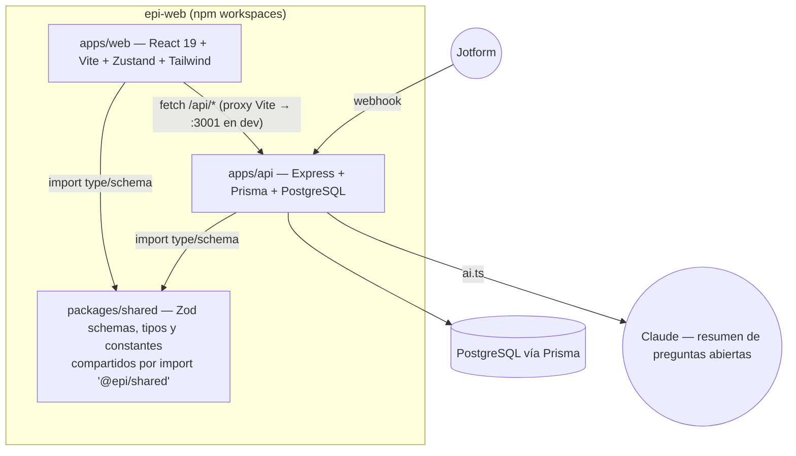
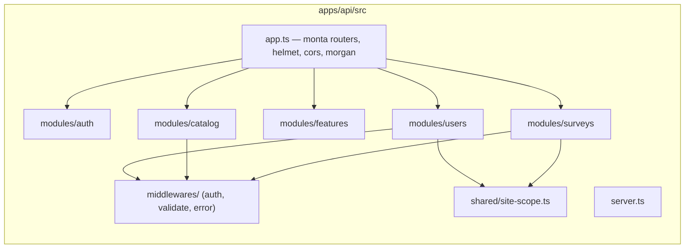
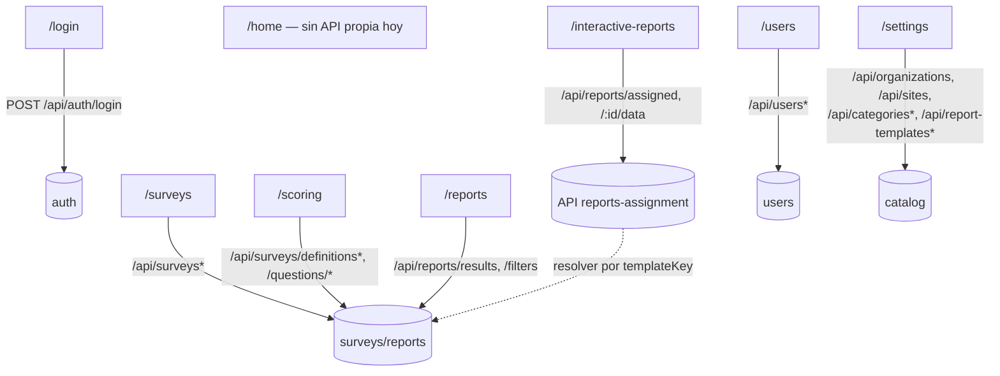
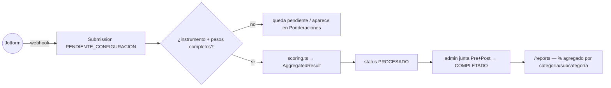
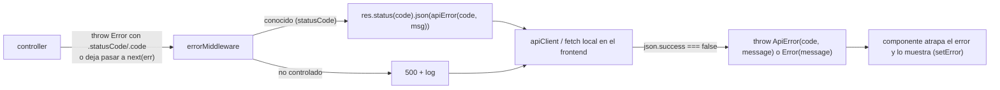

# EPI SGI — Arquitectura general: interacción Front/Backend

> Documento de arquitectura pensado para verse en Obsidian (los bloques
> `mermaid` se renderizan nativos). Es el mapa de **todo el sistema**:
> cómo se comunican `apps/web` y `apps/api`, qué módulos existen y cómo
> encajan. Para el detalle profundo de cada módulo, ver:
>
> - [`administracion-accesos-flujo.md`](./administracion-accesos-flujo.md) — usuarios, roles, organizaciones, sitios, seguridad.
> - [`evaluaciones-flujo.md`](./evaluaciones-flujo.md) — ingesta Jotform, ponderación, cálculo, reportes agregados.
> - [`../apps/api/src/modules/surveys/README.md`](../apps/api/src/modules/surveys/README.md) — qué cambió en la última iteración de encuestas.

## 1. Monorepo y stack



`packages/shared` es la fuente única de verdad de tipos y validación (Zod):
`user.schema.ts`, `org.schema.ts`, `survey.schema.ts`,
`report-template.schema.ts`, `features-registry.ts`. Backend y frontend
importan de ahí — no hay tipos duplicados a mano entre las dos apps.

## 2. Capas del backend (por módulo)



Todos los módulos "reales" (`auth`, `users`, `surveys`) siguen
`routes → controller → service → repository`. `catalog` es la excepción
deliberada: CRUD delgado de organizaciones/sitios/categorías/plantillas de
reporte con handlers inline en el router
(`// ponytail: separar en capas cuando el catálogo tenga lógica de negocio
real`, ver `apps/api/src/modules/catalog/catalog.routes.ts`).

## 3. Rutas del backend (por prefijo)

| Prefijo                                                                          | Router                              | Middleware base                                      | Detalle                                                                  |
| -------------------------------------------------------------------------------- | ----------------------------------- | ---------------------------------------------------- | ------------------------------------------------------------------------ |
| `/api/auth`                                                                      | `authRouter`                        | — (público)                                          | Login → JWT                                                              |
| `/api/users`                                                                     | `usersRouter`                       | `requireAuth` (+ `requireRole` en altas/bajas)       | Ver [administracion-accesos-flujo.md](./administracion-accesos-flujo.md) |
| `/api/features`                                                                  | `featuresRouter`                    | `requireAuth`                                        | Catálogo de `featureKeys`                                                |
| `/api/webhooks/jotform`                                                          | `webhooksRouter`                    | Secreto compartido (no JWT)                          | Ingesta de respuestas                                                    |
| `/api/surveys`                                                                   | `surveysRouter`                     | `requireAuth` + `requireFunctionality`/`requireRole` | Ver [evaluaciones-flujo.md](./evaluaciones-flujo.md)                     |
| `/api/reports`                                                                   | `reportsRouter`                     | `requireAuth`                                        | Resultados agregados pre/post (`/results`, `/filters`)                   |
| `/api/reports`                                                                   | `assignedReportsRouter` (mismo prefijo) | `requireAuth` (+ `requireRole` en gestión)        | Reportes asignados/documento — ver [§7](#7-reportes-dos-sistemas-distintos-conviviendo) |
| `/api/organizations`, `/api/sites`, `/api/categories*`, `/api/report-templates*` | `catalogRouter` (montado en `/api`) | `requireAuth` (+ `requireRole` en altas)             | Ver [administracion-accesos-flujo.md](./administracion-accesos-flujo.md) |

## 4. Rutas del frontend y qué backend consumen



Cada ruta está detrás de `RoleGate` (ver
[administracion-accesos-flujo.md §10](./administracion-accesos-flujo.md#10-frontend--mapa-de-rutas-y-gates)).
`AppLayout` envuelve las rutas con sidebar; `ReportLayout` es un layout sin
sidebar exclusivo para `/interactive-reports`.

## 5. Cliente HTTP: online vs. offline (PWA)

```mermaid
sequenceDiagram
    participant UI as Componente
    participant AC as lib/api-client.ts
    participant OFF as lib/offline.ts + lib/db.ts (IndexedDB/Dexie)
    participant API as Backend

    UI->>AC: apiClient.get/post/patch/delete(path, body)
    alt navigator.onLine = false
        AC->>OFF: resolveOfflineGet (GET) / applyOptimisticWrite (POST/PATCH/DELETE)
        OFF-->>AC: dato cacheado / escritura optimista + encola en mutationQueue
        AC-->>UI: resultado (offline)
    else online
        AC->>API: fetch con Authorization Bearer
        API-->>AC: ApiResponse<T> ({ success, data } o { success:false, error })
        AC-->>UI: data (o lanza ApiError)
    end

    Note over UI,API: al volver "online" (evento window), lib/sync.ts#flushMutationQueue<br/>reenvía la cola en orden y reconsulta (seedDatabase) para traer cambios de otros clientes
```

**Cobertura real hoy:** el cacheo offline (`db.ts`, `offline.ts`) está
implementado solo para `/api/users` (list/detail/create/update/delete) y
es lo que usa `auth.store.ts` (login → `seedDatabase`) y `UsersPage.tsx`
(vía `apiClient`, corregido en esta iteración — antes usaba `fetch()`
directo y nunca pasaba por esta capa). El resto de las páginas
(`surveys/api.ts` también usa `apiClient`; `reports/api.ts` y
`SettingsPage.tsx` usan sus propios `fetch()` locales) **no** tienen
resolutor offline — si se llaman sin conexión, fallan con
"No offline resolver/handler for ...". No hay indicio en el código de que
se haya decidido extender el offline-first a otros módulos; documentarlo
aquí para que la próxima persona no asuma que ya está cubierto.

## 6. Ciclo de vida de una encuesta (resumen — detalle en evaluaciones-flujo.md)



## 7. Reportes: dos sistemas distintos conviviendo

Es importante no confundirlos — comparten la palabra "reporte" pero son
piezas separadas del código, con **propósitos de negocio distintos**
(aclarado explícitamente en conversación con EPI, no es solo una diferencia
técnica):

1. **`/reports` (dashboard agregado, con sidebar — `AppLayout`)** —
   herramienta **interna** para el usuario operativo: ve los resultados %
   pre/post crudos por categoría/subcategoría/sitio/escuela/fecha (filtros
   en vivo — `ReportsPage.tsx` llama `GET /api/reports/results` y
   `/filters`, parte del módulo de encuestas) y arma un documento libre por
   secciones (título/texto/barra/araña/cambio/tabla) para **dar visto
   bueno** a la información antes de que salga como reporte oficial. No es
   lo que ve el donante — es el paso de revisión previo.
   - Los filtros `from`/`to` llegaban a la UI pero el backend los ignoraba
     (`ReportFiltersSchema` no los declaraba, zod los descartaba en
     silencio) — corregido: ahora sí acotan `Submission.receivedAt`
     (`surveys.repository.ts#completedWithResults`).
   - La página ya no exige elegir un filtro primero para ver algo: al
     entrar carga de una vez todo lo que el usuario puede ver (antes se
     quedaba en blanco sin explicación hasta tocar un dropdown).
   - Descarga como PDF real (no `window.print()`) vía
     `features/reports/lib/report-pdf.tsx` (`@react-pdf/renderer`,
     cargado con `import()` dinámico solo al pedir la descarga — no pesa en
     la carga inicial de la página).

2. **`/interactive-reports` (documentos institucionales, sin sidebar —
   `ReportLayout`)** — lo que ve el **donante o quien toma decisiones**:
   la única pantalla disponible para un `report_viewer` típico. Son
   reportes por temporada/periodo (Local/Visitante, por sitio) con un
   diseño institucional fijo que EPI está terminando de definir — hoy hay
   **una plantilla de prueba conectada a datos reales** (`seasonal-site-report`)
   más las dos plantillas de ejemplo originales
   (`activities-attendance`, `operational-financial`, que piden
   ingresos/gastos y asistencia — datos que no existen en el modelo, siguen
   sin resolver real).

   ```mermaid
   sequenceDiagram
       participant Op as Operativo (admin_tier)
       participant FE as ReportAssignmentsPage
       participant API as reports-assignment
       participant Res as report-data-resolvers.ts
       participant Surv as surveys.repository

       Op->>FE: elige plantilla + llena campos de texto (logros/retos...)
       FE->>API: POST/PATCH /api/reports/assignments { templateKey, textContent }
       API->>API: guarda AssignedReport (status pending→in_review→published)
       Note over Op,API: publicado → visible para el usuario asignado

       participant RV as report_viewer (donante)
       participant IR as InteractiveReportsPage
       RV->>IR: abre su reporte, mueve dropdown Sitio/Global
       IR->>API: GET /api/reports/:id/data?siteId=...
       API->>Res: REPORT_DATA_RESOLVERS[templateKey]({siteId, scope})
       Res->>Surv: completedWithResults + aggregateCategoryResults<br/>(mismo cálculo que /reports)
       Surv-->>Res: kpis/series/tables reales
       API-->>IR: { kpis, series, tables, texts: AssignedReport.textContent }
       RV->>IR: "Descargar PDF" → lib/document-pdf.tsx (@react-pdf/renderer)
   ```

   Piezas nuevas de esta iteración:
   - **`report-data-resolvers.ts`** (`modules/reports-assignment/`): registro
     `templateKey → resolver`, análogo a `getReportTemplate()` en el
     frontend. Una plantilla sin resolver registrado sigue devolviendo
     `{kpis:{}, series:{}, tables:{}}` (comportamiento anterior, no rompe).
     El alcance de sitios usado es el del **usuario asignado al reporte**,
     no el de quien lo consulta (`allowedSiteIds` sobre los datos del
     dueño) — así un admin que revisa el reporte de otro ve exactamente lo
     que ese donante vería.
   - **`AssignedReport.textContent`** (Json, nuevo campo — migración
     `add_assigned_report_text_content`, versionado igual que `filters` en
     `AssignedReportVersion`): campos de texto libre (logros, retos,
     comentarios) que el operativo llena por reporte. El backend los guarda
     tal cual, sin conocer sus claves — la plantilla del frontend
     (`TextBlock.dataKey` + `getFillableTextFields()` en
     `templates/types.ts`) es quien declara qué campos existen; el
     formulario de llenado en `ReportAssignmentsPage.tsx` se genera solo a
     partir de eso.
   - **Filtro Sitio/Global en `/interactive-reports`**: el propio donante
     mueve un dropdown de sitio (o "Global" = todo su alcance),
     reutilizando `GET /api/reports/filters` (el mismo que usa `/reports`)
     para poblar las opciones — acotado a la organización/exclusiones del
     usuario asignado.
   - **PDF real** (`features/reports/lib/document-pdf.tsx`): reemplaza el
     `window.print()` que tenía `DocumentReportPage.tsx`. Mismo patrón que
     `report-pdf.tsx` (§ arriba) pero renderiza el sistema de bloques
     `kpi-group`/`chart`/`table`/`text` de las plantillas en vez de las
     secciones del constructor — `chart` tipo `pie` se aproxima como
     barras de % del total (geometría circular real pendiente si hace
     falta). Ambos generadores comparten el chunk pesado de
     `@react-pdf/renderer` (~480kB gzip) pero no se cargan hasta pedir la
     descarga.

   **Sigue pendiente:**
   - `activities-attendance` y `operational-financial` siguen sin resolver
     real — piden datos (ingresos/gastos, asistencia) que no existen en el
     modelo. `seasonal-site-report` es una plantilla de **prueba** para
     validar el pipeline completo, no uno de los diseños institucionales
     finales.
   - Los **N diseños reales** (uno por tipo de reporte que EPI necesite)
     están por definirse — cuando existan, cada uno es una plantilla nueva
     en `features/reports/templates/` + (si pide datos que hoy no se
     calculan) un resolver nuevo en `report-data-resolvers.ts`. La
     plomería (resolver registry, `textContent`, filtro sitio/global, PDF
     institucional) ya está lista para recibirlos.
   - `features/reports/api.ts` sigue sin pasar por `apiClient`/`offline.ts`
     (ver [§5](#5-cliente-http-online-vs-offline-pwa)) — ninguna pantalla
     de reportes funciona sin conexión, sin cambios en esta iteración.

## 8. Manejo de errores end-to-end



Todas las respuestas siguen el sobre `ApiResponse<T>` de `@epi/shared`:
`{ success: true, data, meta? }` o `{ success: false, error: { code, message, details? } }`.
Los servicios lanzan `Object.assign(new Error(msg), { statusCode, code })`
y los controllers lo traducen 1:1 — es el mismo patrón en `users`,
`catalog` (vía `wrap()`) y `surveys`.

## 9. Qué revisar primero si algo no cuadra

- **¿Un usuario ve datos que no debería?** → empezar por
  `apps/api/src/shared/site-scope.ts` (`allowedSiteIds`) y
  `apps/api/src/modules/users/users.service.ts` (`#assertOrgAccess`);
  documentado en detalle en
  [administracion-accesos-flujo.md §5–6](./administracion-accesos-flujo.md#5-autorización--qué-valida-cada-capa).
- **¿Una respuesta de Jotform no aparece?** → `SubmissionStatus` y el
  árbol de decisión de `processSubmission`, en
  [evaluaciones-flujo.md §3–4](./evaluaciones-flujo.md#3-backend--ingesta-del-webhook-post-apiwebhooksjotform).
- **¿Algo falla solo en el celular/sin internet?** → §5 de este documento;
  probablemente el módulo en cuestión no pasa por `apiClient`/`offline.ts`.
