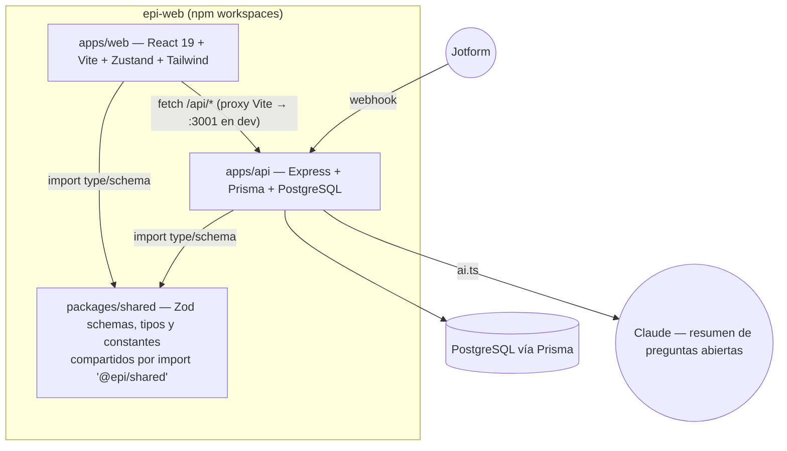
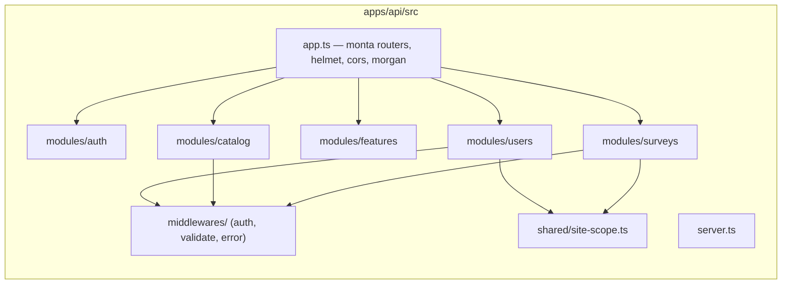
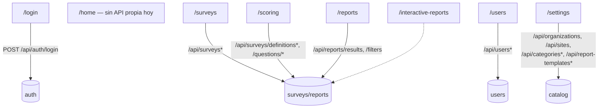
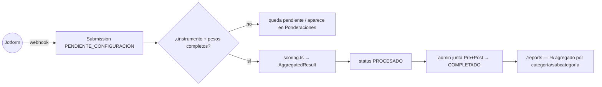
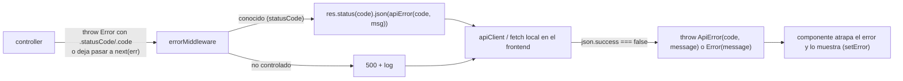

# EPI SGI — Arquitectura general: interacción Front/Backend

> Documento de arquitectura pensado para verse en Obsidian (los bloques
> `mermaid` se renderizan nativos). Es el mapa de **todo el sistema**:
> cómo se comunican `apps/web` y `apps/api`, qué módulos existen y cómo
> encajan. Para el detalle profundo de cada módulo, ver:
>
> - [`administracion-accesos-flujo.md`](./administracion-accesos-flujo.md) — usuarios, roles, organizaciones, sitios, seguridad.
> - [`evaluaciones-flujo.md`](./evaluaciones-flujo.md) — ingesta Jotform, ponderación, cálculo, reportes agregados.
> - [`../apps/api/src/modules/surveys/README.md`](../apps/api/src/modules/surveys/README.md) — qué cambió en la última iteración de encuestas.

## 1. Monorepo y stack



`packages/shared` es la fuente única de verdad de tipos y validación (Zod):
`user.schema.ts`, `org.schema.ts`, `survey.schema.ts`,
`report-template.schema.ts`, `features-registry.ts`. Backend y frontend
importan de ahí — no hay tipos duplicados a mano entre las dos apps.

## 2. Capas del backend (por módulo)



Todos los módulos "reales" (`auth`, `users`, `surveys`) siguen
`routes → controller → service → repository`. `catalog` es la excepción
deliberada: CRUD delgado de organizaciones/sitios/categorías/plantillas de
reporte con handlers inline en el router
(`// ponytail: separar en capas cuando el catálogo tenga lógica de negocio
real`, ver `apps/api/src/modules/catalog/catalog.routes.ts`).

## 3. Rutas del backend (por prefijo)

| Prefijo                                                                          | Router                              | Middleware base                                      | Detalle                                                                  |
| -------------------------------------------------------------------------------- | ----------------------------------- | ---------------------------------------------------- | ------------------------------------------------------------------------ |
| `/api/auth`                                                                      | `authRouter`                        | — (público)                                          | Login → JWT                                                              |
| `/api/users`                                                                     | `usersRouter`                       | `requireAuth` (+ `requireRole` en altas/bajas)       | Ver [administracion-accesos-flujo.md](./administracion-accesos-flujo.md) |
| `/api/features`                                                                  | `featuresRouter`                    | `requireAuth`                                        | Catálogo de `featureKeys`                                                |
| `/api/webhooks/jotform`                                                          | `webhooksRouter`                    | Secreto compartido (no JWT)                          | Ingesta de respuestas                                                    |
| `/api/surveys`                                                                   | `surveysRouter`                     | `requireAuth` + `requireFunctionality`/`requireRole` | Ver [evaluaciones-flujo.md](./evaluaciones-flujo.md)                     |
| `/api/reports`                                                                   | `reportsRouter`                     | `requireAuth`                                        | Resultados agregados pre/post                                            |
| `/api/organizations`, `/api/sites`, `/api/categories*`, `/api/report-templates*` | `catalogRouter` (montado en `/api`) | `requireAuth` (+ `requireRole` en altas)             | Ver [administracion-accesos-flujo.md](./administracion-accesos-flujo.md) |

## 4. Rutas del frontend y qué backend consumen



Cada ruta está detrás de `RoleGate` (ver
[administracion-accesos-flujo.md §10](./administracion-accesos-flujo.md#10-frontend--mapa-de-rutas-y-gates)).
`AppLayout` envuelve las rutas con sidebar; `ReportLayout` es un layout sin
sidebar exclusivo para `/interactive-reports`.

## 5. Cliente HTTP: online vs. offline (PWA)

```mermaid
sequenceDiagram
    participant UI as Componente
    participant AC as lib/api-client.ts
    participant OFF as lib/offline.ts + lib/db.ts (IndexedDB/Dexie)
    participant API as Backend

    UI->>AC: apiClient.get/post/patch/delete(path, body)
    alt navigator.onLine = false
        AC->>OFF: resolveOfflineGet (GET) / applyOptimisticWrite (POST/PATCH/DELETE)
        OFF-->>AC: dato cacheado / escritura optimista + encola en mutationQueue
        AC-->>UI: resultado (offline)
    else online
        AC->>API: fetch con Authorization Bearer
        API-->>AC: ApiResponse<T> ({ success, data } o { success:false, error })
        AC-->>UI: data (o lanza ApiError)
    end

    Note over UI,API: al volver "online" (evento window), lib/sync.ts#flushMutationQueue<br/>reenvía la cola en orden y reconsulta (seedDatabase) para traer cambios de otros clientes
```

**Cobertura real hoy:** el cacheo offline (`db.ts`, `offline.ts`) está
implementado solo para `/api/users` (list/detail/create/update/delete) y
es lo que usa `auth.store.ts` (login → `seedDatabase`) y `UsersPage.tsx`
(vía `apiClient`, corregido en esta iteración — antes usaba `fetch()`
directo y nunca pasaba por esta capa). El resto de las páginas
(`surveys/api.ts` también usa `apiClient`; `reports/api.ts` y
`SettingsPage.tsx` usan sus propios `fetch()` locales) **no** tienen
resolutor offline — si se llaman sin conexión, fallan con
"No offline resolver/handler for ...". No hay indicio en el código de que
se haya decidido extender el offline-first a otros módulos; documentarlo
aquí para que la próxima persona no asuma que ya está cubierto.

## 6. Ciclo de vida de una encuesta (resumen — detalle en evaluaciones-flujo.md)



## 7. Reportes: dos sistemas distintos conviviendo

Es importante no confundirlos — comparten la palabra "reporte" pero son
piezas separadas del código:

1. **`/reports` (dashboard agregado)** — `ReportsPage.tsx` llama
   `GET /api/reports/results` y `/filters` (implementado, parte del
   módulo de encuestas). Muestra % pre/post por categoría/subcategoría.
2. **`/interactive-reports` (documentos con plantilla)** —
   `InteractiveReportsPage.tsx` / `DocumentReportPage.tsx` +
   `features/reports/templates/*.template.ts` (plantillas tipadas:
   `activities-attendance`, `operational-financial`) +
   `ReportRenderer`/`ChartBlockView` para renderizar bloques de gráficos.
   Su cliente (`features/reports/api.ts`) llama
   `GET /api/reports/assigned` y `GET /api/reports/:id/data`, servidos por
   `modules/reports-assignment/` — persistencia, aprobación
   (`pending`/`in_review`/`published`) y versiones históricas ya existen
   (ver [administracion-accesos-flujo.md §8](./administracion-accesos-flujo.md#8-brechas-frente-a-la-especificación)).
   Panel de asignación en `/report-assignments`. Lo que sigue sin resolver
   es de dónde sale el número de cada reporte: las dos plantillas de
   ejemplo (`activities-attendance`, `operational-financial`) piden datos
   que no existen en el modelo (ingresos/gastos, asistencia), así que
   `GET /:id/data` devuelve siempre `kpis`/`series`/`tables` vacíos —
   conectar una plantilla real a datos reales es trabajo aparte, pendiente
   de que EPI defina qué reportes necesita.

## 8. Manejo de errores end-to-end



Todas las respuestas siguen el sobre `ApiResponse<T>` de `@epi/shared`:
`{ success: true, data, meta? }` o `{ success: false, error: { code, message, details? } }`.
Los servicios lanzan `Object.assign(new Error(msg), { statusCode, code })`
y los controllers lo traducen 1:1 — es el mismo patrón en `users`,
`catalog` (vía `wrap()`) y `surveys`.

## 9. Qué revisar primero si algo no cuadra

- **¿Un usuario ve datos que no debería?** → empezar por
  `apps/api/src/shared/site-scope.ts` (`allowedSiteIds`) y
  `apps/api/src/modules/users/users.service.ts` (`#assertOrgAccess`);
  documentado en detalle en
  [administracion-accesos-flujo.md §5–6](./administracion-accesos-flujo.md#5-autorización--qué-valida-cada-capa).
- **¿Una respuesta de Jotform no aparece?** → `SubmissionStatus` y el
  árbol de decisión de `processSubmission`, en
  [evaluaciones-flujo.md §3–4](./evaluaciones-flujo.md#3-backend--ingesta-del-webhook-post-apiwebhooksjotform).
- **¿Algo falla solo en el celular/sin internet?** → §5 de este documento;
  probablemente el módulo en cuestión no pasa por `apiClient`/`offline.ts`.
