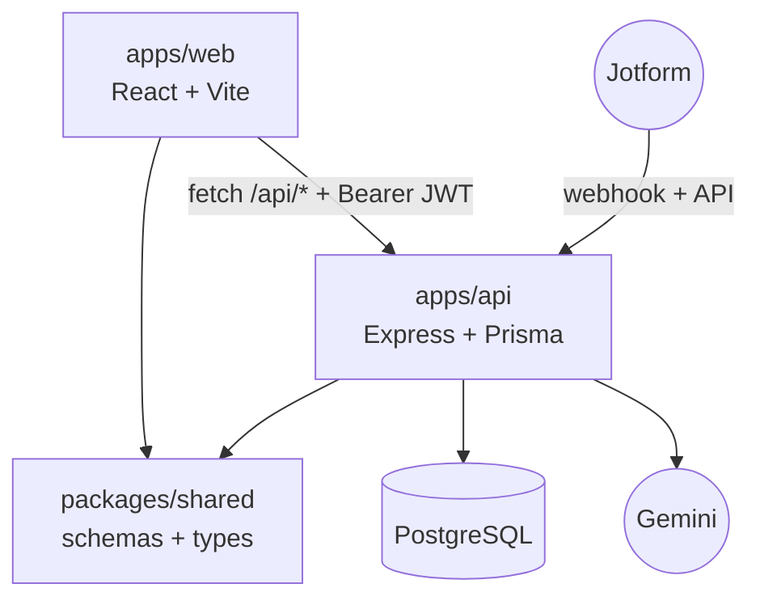

# Arquitectura

## Resumen

EPI Web es un monorepo TypeScript con tres piezas:

```text
apps/api       Express + Prisma + modulos de negocio
apps/web       React + Vite
packages/shared schemas Zod, tipos API y registro de features
```



## Frontend

- React/Vite en `apps/web`.
- Rutas protegidas con `RoleGate`.
- Estado de sesion con Zustand en `auth.store.ts`.
- Cache/offline parcial con Dexie/IndexedDB.
- Reportes con Recharts y PDF con `@react-pdf/renderer`.

Rutas principales:

| Ruta | Uso |
| --- | --- |
| `/login` | Inicio de sesion. |
| `/home` | Dashboard inicial. |
| `/users` | Usuarios y permisos. |
| `/organizations` | Organizaciones. |
| `/sites` | Sitios. |
| `/categories` | Categorias/subcategorias. |
| `/surveys` | Encuestas recibidas. |
| `/scoring` | Instrumentos y ponderaciones. |
| `/open-questions` | Analisis IA de preguntas abiertas. |
| `/reports` | Reportes agregados. |
| `/interactive-reports` | Reportes asignados interactivos. |
| `/report-assignments` | Administracion de reportes asignados. |
| `/audit-log` | Bitacora. |

## Backend

- Express en `apps/api`.
- Validacion con Zod.
- Prisma para PostgreSQL.
- JWT Bearer en rutas bajo `/api`.
- `POST /api/auth/login` y `/api/webhooks/jotform` son publicas; el resto requiere autenticacion.
- En produccion sirve `apps/web/dist` desde el mismo proceso.

## PostgreSQL

Tablas centrales:

- `users`, `features`, `user_features`, `report_templates`, `user_report_templates`.
- `organizations`, `sites`, `categories`, `institutional_positions`.
- `jotform_accounts`, `jotform_forms`, `catalog_fields`.
- `survey_definitions`, `questions`, `weights`, `submissions`, `participants`, `answers`, `aggregated_results`.
- `assigned_reports`, `assigned_report_versions`.
- `audit_logs`.

## Railway

El despliegue esperado es single-service:

1. Build de `packages/shared`, API y web.
2. Migraciones Prisma contra PostgreSQL.
3. `apps/api` inicia y sirve API + frontend estatico.

Ver [instalacion y despliegue](./instalacion.md).

## Jotform

La integracion tiene dos entradas:

- API de Jotform: sincroniza cuentas, formularios, preguntas y respuestas historicas.
- Webhook: recibe respuestas nuevas en `/api/webhooks/jotform`.

El JSON crudo de cada respuesta se conserva en `Submission.rawJsonData`. Si falta configuracion o ponderacion, la respuesta queda pendiente y puede reprocesarse.

## Documentos tecnicos detallados

- [Arquitectura frontend/backend detallada](./arquitectura-front-backend.md)
- [Administracion, usuarios y seguridad](./administracion-accesos-flujo.md)
- [Evaluaciones y Jotform](./evaluaciones-flujo.md)
