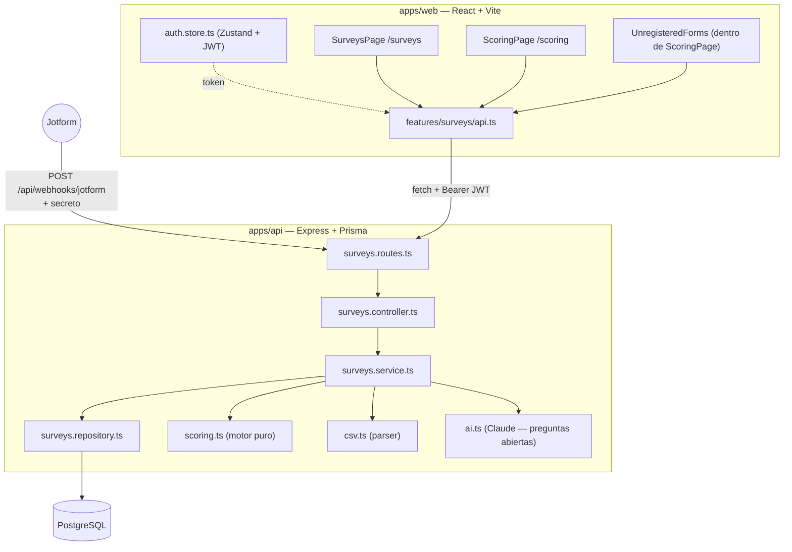
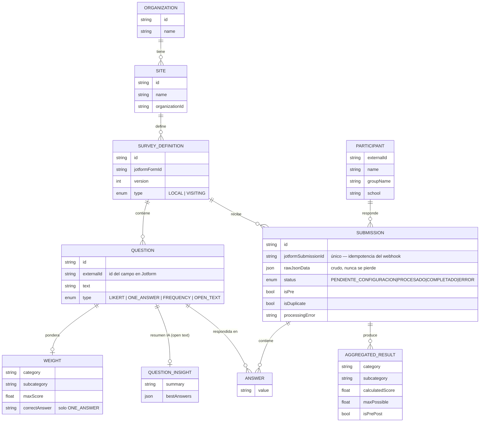
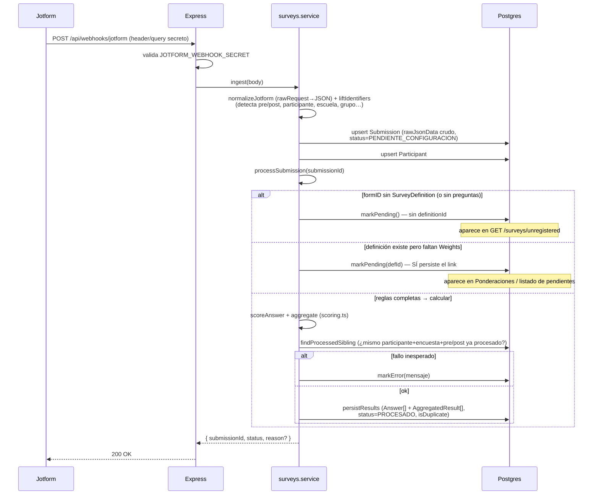
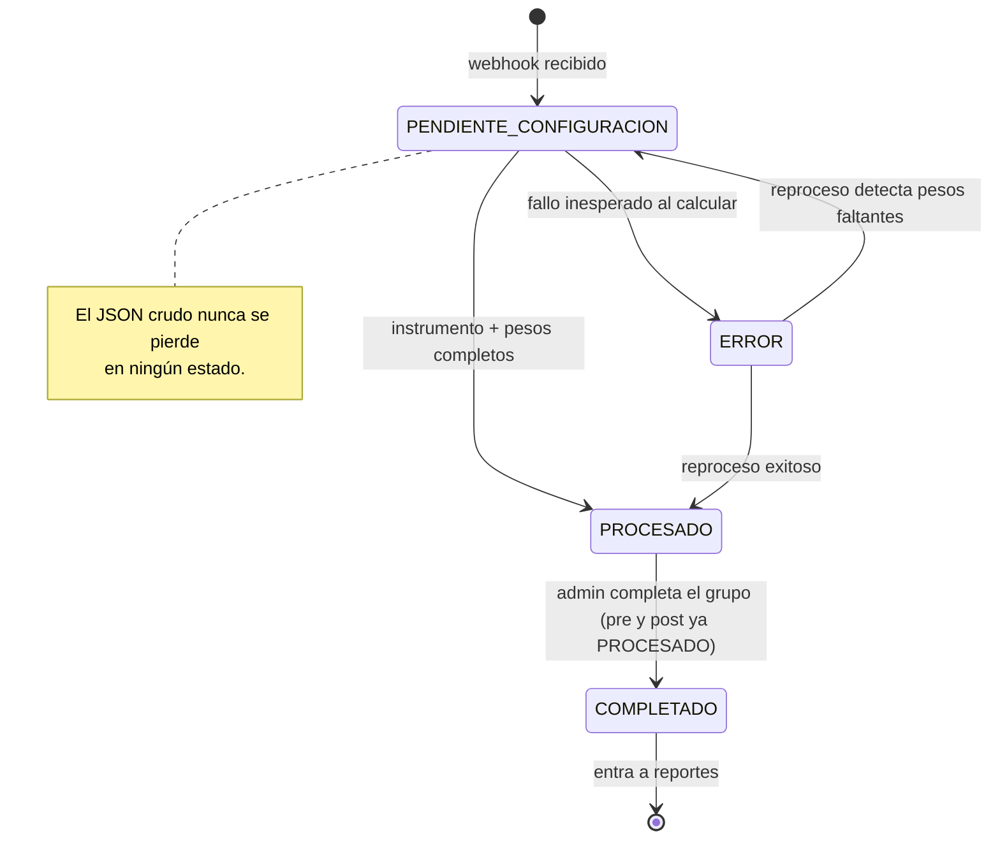
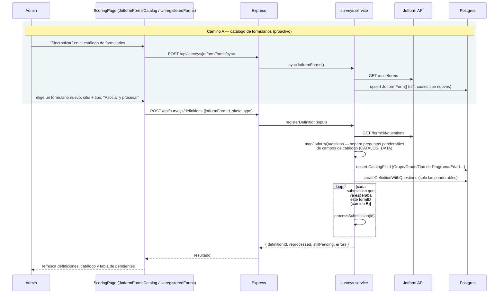
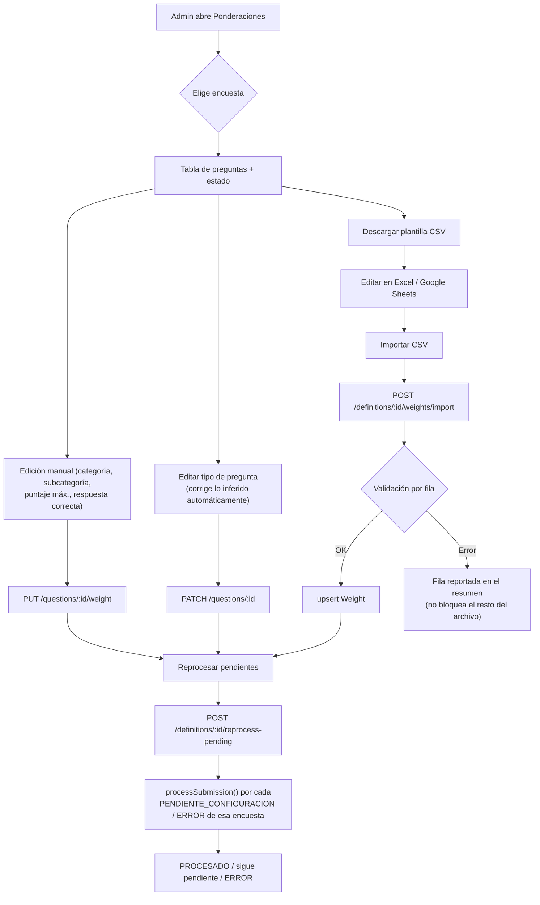
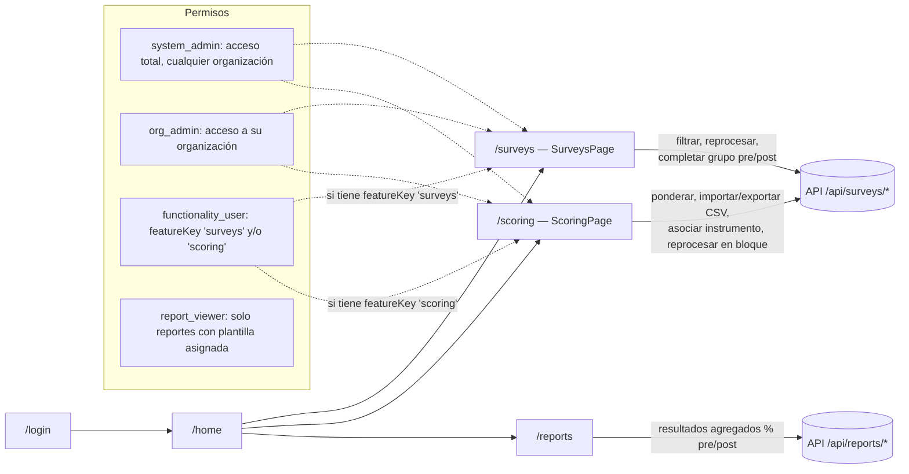

# Módulo de Gestión de Evaluaciones — Funcionalidad y flujo

> Documento de arquitectura pensado para verse en Obsidian (los bloques
> ```mermaid``` se renderizan nativos). Complementa a
> [`apps/api/src/modules/surveys/README.md`](../apps/api/src/modules/surveys/README.md),
> que lleva el detalle de qué se agregó en la última iteración y qué queda
> pendiente de definir con EPI. Este documento es el mapa completo: toda la
> funcionalidad, cómo fluyen los datos y cómo interactúan backend y frontend.
> Para el módulo de Administración/Usuarios/Seguridad ver
> [`administracion-accesos-flujo.md`](./administracion-accesos-flujo.md); para
> el mapa general de todo el sistema ver
> [`arquitectura-front-backend.md`](./arquitectura-front-backend.md).

## 1. Panorama general



## 2. Modelo de datos



## 3. Backend — ingesta del webhook (`POST /api/webhooks/jotform`)



## 4. Ciclo de vida de una respuesta (`SubmissionStatus`)



## 5. Alta de un instrumento nuevo

Dos caminos conviven, según si el admin quiere configurar el instrumento
**antes** de que lleguen respuestas o reaccionar a lo que **ya** llegó:



**Camino A — catálogo de formularios** (`JotformFormsCatalog.tsx`,
`GET/POST /api/surveys/jotform/forms*`): trae el listado completo de la
cuenta de Jotform (`GET /user/forms`) a una tabla cacheada (`JotformForm`),
marca cuáles ya están dados de alta (`registered`), y permite registrar uno
nuevo sin depender de que ya haya enviado respuestas — sus preguntas se
descargan en vivo (`GET /form/:id/questions`).

**Camino B — instrumentos sin configurar** (`UnregisteredForms.tsx`,
`GET /api/surveys/unregistered`): el que ya existía — formularios que **ya**
mandaron respuestas por webhook pero nunca se asociaron a un sitio. Sigue
sirviendo para el caso de un formID que llega por sorpresa sin haber sido
sincronizado antes.

Ambos caminos terminan en el mismo `registerDefinition()`, que **ya no
infiere** el tipo de pregunta de las respuestas crudas (la heurística
anterior "valor numérico → LIKERT" se eliminó) — ahora usa el tipo de
control real que reporta Jotform (`jotform-questions.ts#mapJotformQuestions`):

| Control de Jotform | `QuestionType` |
|---|---|
| `control_scale` | `LIKERT` |
| `control_radio` / `control_dropdown` / `control_checkbox` | `ONE_ANSWER` (el admin corrige a `FREQUENCY` a mano si aplica — no hay forma automática de distinguirlos) |
| `control_textarea` / `control_textbox` | `OPEN_TEXT` |
| `control_head` / `control_collapse` / `control_button` / `control_page` | se descartan (no son preguntas) |

### 5.1 Campos de catálogo (`CATALOG_DATA`)

Antes de clasificar una pregunta como ponderable, se compara su `text`
(sin distinguir mayúsculas/acentos) contra la env `CATALOG_DATA` — lista de
etiquetas separadas por coma, ej. `GRUPO,GRADO,TIPO DE PROGRAMA,EDAD`. Si
matchea, la pregunta **no** se crea como `Question`: se guarda como
`CatalogField` (`label` + `options`, combinando/deduplicando opciones si
varios formularios comparten la misma pregunta de catálogo) vía
`GET /api/catalog-fields`. Sirve para poblar filtros de reporte (sitio,
grupo, grado…) sin mezclar esos campos con las preguntas que sí se ponderan.

### 5.2 El webhook real de Jotform (dos formatos distintos)

`normalizeJotform()` en `surveys.service.ts` tiene que reconciliar **dos**
formas en las que llega el crudo, ambas distintas del formato interno
(`answers: [{questionId, value}]`) que valida `JotformPayloadSchema`:

- **Webhook en vivo** (`POST /api/webhooks/jotform`): Jotform manda
  `multipart/form-data` (por eso la ruta monta `multer().none()` — ni
  `express.json()` ni `express.urlencoded()` parsean multipart) con un
  campo `rawRequest` que es un string JSON **plano**, keyed por el `name`
  del campo (ej. `{"q3_dropdown1":"Grupo 1", ...}`). Se aplana a
  `answers[]` tomando cada clave como `questionId`.
- **Importación vía API de submissions** (`GET /form/:id/submissions` —
  no implementada como importador todavía, solo el shape está contemplado):
  `answers` viene anidado por `qid`, cada uno con `{name, text, type,
  answer}`. Se aplana igual, tomando `name` como `questionId` y `answer`
  como el valor.

En ambos casos el identificador estable usado como `Question.externalId`
es el `name` de Jotform (ej. `q3_dropdown1`) — es el único campo presente
en las tres fuentes (preguntas, submissions API y webhook real), a
diferencia de `qid` que no viaja en el webhook.

⚠️ **Pendiente de confirmar con un webhook real**: `liftIdentifiers()` (la
función que detecta pre/post, escuela, grupo, edad, género a partir de
claves como `"escuela"`/`"grupo"`) sigue sin tocar — pero esas claves
literales no existen en formularios reales (los nombres de campo son
autogenerados, ej. `q3_dropdown1`). Con datos reales, esa detección no
encuentra nada. Ver conversación / issue abierto: falta decidir cómo mapear
grupo/edad/escuela/género/pre-post a `Participant` ahora que los nombres de
campo no son semánticos.

## 6. Configuración de ponderaciones (manual, CSV y reproceso en bloque)



## 7. Frontend — mapa de rutas y permisos



Dentro de `/scoring`, la sección **"Instrumentos sin configurar"** (alta de
formularios nuevos) solo se muestra si el usuario es `system_admin` u
`org_admin` — es una decisión de a qué sitio pertenece un instrumento nuevo,
no una tarea de ponderación cualquiera.

## 8. Interacción completa: usuario configurando pesos hasta ver el reporte

```mermaid
sequenceDiagram
    participant U as Usuario (admin/functionality_user)
    participant FE as Frontend (ScoringPage/SurveysPage)
    participant API as API
    participant DB as Postgres

    Note over U,DB: Jotform ya mandó respuestas; algunas quedaron PENDIENTE_CONFIGURACION
    U->>FE: entra a /scoring, elige la encuesta
    FE->>API: GET /definitions/:id/questions
    API->>DB: preguntas + Weight (o null)
    API-->>FE: tabla con estado de configuración
    U->>FE: completa puntaje/categoría por pregunta y Guarda
    FE->>API: PUT /questions/:id/weight
    API->>DB: upsert Weight
    U->>FE: click "Reprocesar pendientes"
    FE->>API: POST /definitions/:id/reprocess-pending
    API->>DB: reprocesa cada PENDIENTE_CONFIGURACION/ERROR de esa encuesta
    API-->>FE: { reprocessed, stillPending, errors }

    U->>FE: entra a /surveys — ve status PROCESADO, revisa duplicados/errores
    U->>FE: cuando pre y post de un grupo están PROCESADO → "Completar"
    FE->>API: POST /surveys/groups/complete { groupName }
    API->>DB: valida pre y post existen, marca COMPLETADO

    U->>FE: entra a /reports
    FE->>API: GET /reports/results (solo status=COMPLETADO)
    API->>DB: agrega % pre/post por categoría/subcategoría
    API-->>FE: filas del dashboard
```

## 9. Endpoints (resumen)

| Método | Ruta | Quién | Qué hace |
|---|---|---|---|
| `POST` | `/api/webhooks/jotform` | Público (secreto) | Ingesta y dispara `processSubmission` |
| `GET` | `/api/surveys` | `surveys` | Listado filtrable de respuestas |
| `GET` | `/api/surveys/pending` | `surveys` | Solo `PENDIENTE_CONFIGURACION` |
| `GET` | `/api/surveys/summary` / `POST /groups/complete` | `surveys` | Resumen y cierre por grupo pre/post |
| `POST` | `/api/surveys/:id/reprocess` | `surveys` | Reintenta una respuesta puntual |
| `GET` | `/api/surveys/unregistered` | `system_admin`/`org_admin` | Formularios de Jotform sin asociar (camino B, §5) |
| `GET` | `/api/surveys/jotform/forms` | `system_admin`/`org_admin` | Catálogo local de formularios (camino A, §5) |
| `POST` | `/api/surveys/jotform/forms/sync` | `system_admin`/`org_admin` | `GET /user/forms` en Jotform + diff |
| `GET` | `/api/surveys/jotform/forms/:formId/questions` | `system_admin`/`org_admin` | Preview de preguntas/catálogo en vivo |
| `GET` | `/api/catalog-fields` | Autenticado | Campos de catálogo (Grupo/Grado/...) — `catalogRouter` |
| `POST` | `/api/surveys/definitions` | `system_admin`/`org_admin` | Da de alta un instrumento nuevo (§5) |
| `GET` | `/api/surveys/definitions` / `/:id/questions` | `surveys`/`scoring` | Catálogo de encuestas y preguntas |
| `PUT` | `/api/surveys/questions/:id/weight` | `scoring` | Ponderación manual |
| `PATCH` | `/api/surveys/questions/:id` | `scoring` | Corrige texto/tipo de una pregunta |
| `POST` | `/api/surveys/definitions/:id/weights/import` | `scoring` | Import CSV de ponderaciones |
| `POST` | `/api/surveys/definitions/:id/reprocess-pending` | `scoring` | Reproceso en bloque |
| `POST` | `/api/surveys/questions/:id/analyze` | `scoring` | Resumen IA de una pregunta abierta |
| `GET` | `/api/reports/results` / `/filters` | Cualquier usuario autenticado (acotado) | Dashboard % pre/post |

## 10. Fuera de alcance de este documento

El módulo de **reportes interactivos / plantillas de documentos**
(`apps/web/src/features/reports/`, rutas `/reports` e
`/interactive-reports`) es un feature más amplio que consume estos
resultados agregados pero tiene su propia arquitectura de plantillas — no se
diagrama aquí porque no es parte de la Gestión de Evaluaciones en sí.
